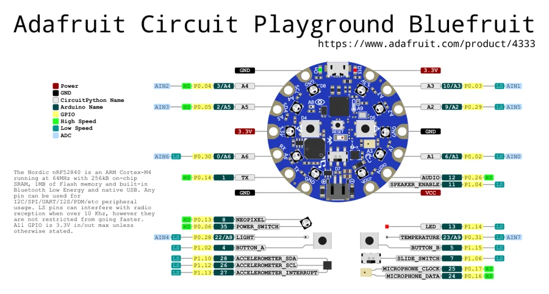

# Circuit Playground Bluefruit

**Adafruit** · Other

Revision: Not identified

Coverage: Physical pinout source collected; scope and revision require confirmation

[Browse all manufacturers](../../../../BROWSE.md) · [Devices & IoT](../../../../DEVICES.md) · [Open in the browser guide](https://valleytech-black-wire-guide.pages.dev/?board=adafruit-circuit-playground-bluefruit)

## Specifications and hardware documentation

- [Specifications & hardware guide](https://www.adafruit.com/product/4333)

## Original manufacturer graphical reference (PDF)

**original reference PDF** · Reviewed source · PDF

[Open original reference](../../../../library/media/c13f407d97451fad061109c737c8e9358c5bc2d879b0ff8d77ebdeac45b7e898.pdf)

**Credit and rights:** Adafruit / original diagram contributors. Rights not established for this asset; attribution retained. Original artwork is not covered by Black Wire's editorial license.. Source/manufacturer: Adafruit.

[Source 1](https://raw.githubusercontent.com/adafruit/Adafruit-Circuit-Playground-Bluefruit-PCB/87ab89a043b8c01b602eeaf1bcf08474abe0336d/Adafruit%20Circuit%20Playground%20Bluefruit%20pinout.pdf) · [Source 2](https://www.adafruit.com/product/4333) · [Source 3](https://github.com/adafruit/Adafruit-Circuit-Playground-Bluefruit-PCB/tree/87ab89a043b8c01b602eeaf1bcf08474abe0336d)

Original publisher reference. Exact board/revision and electrical limits still require confirmation.

Image revision: Not identified

SHA-256: `c13f407d97451fad061109c737c8e9358c5bc2d879b0ff8d77ebdeac45b7e898`

## Manufacturer board pinout — page 1

**pinout image** · Reviewed source · PNG

[Open original reference](../../../../library/media/381adc0c974329d598c2ba237d5d20e247e8a3adbe76f3e6e1db2a41ca0bccc0.png)

**Credit and rights:** Adafruit / original diagram contributors. Rights not established for this asset; attribution retained. Original artwork is not covered by Black Wire's editorial license.. Source/manufacturer: Adafruit.

[Source 1](https://raw.githubusercontent.com/adafruit/Adafruit-Circuit-Playground-Bluefruit-PCB/87ab89a043b8c01b602eeaf1bcf08474abe0336d/Adafruit%20Circuit%20Playground%20Bluefruit%20pinout.pdf) · [Source 2](https://www.adafruit.com/product/4333) · [Source 3](https://github.com/adafruit/Adafruit-Circuit-Playground-Bluefruit-PCB/tree/87ab89a043b8c01b602eeaf1bcf08474abe0336d)

Original publisher reference. Exact board/revision and electrical limits still require confirmation.  PDF page rendered at 144 dpi without changing labels. Original vector PDF retained.

Image revision: Not identified

SHA-256: `381adc0c974329d598c2ba237d5d20e247e8a3adbe76f3e6e1db2a41ca0bccc0`

Pin assignments have not been independently electrically verified. Check board revision before wiring.
