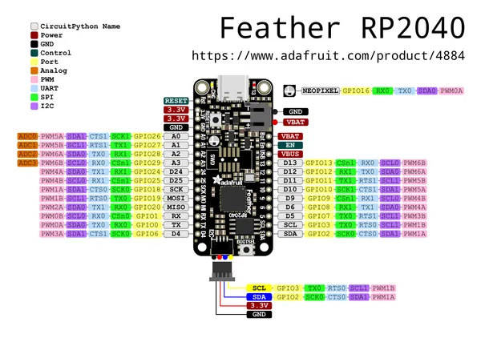

# Feather RP2040

**Adafruit** · RP2040

Revision: Not identified  
Coverage: Pinout image collected

[Browse all manufacturers](../../../../BROWSE.md) · [Desktop app](https://github.com/valleytechsolutions/black-wire-desktop)

## Pinout reference - PDF page 1

**pinout image** · Reviewed source · PNG

[Open original reference](../../../../library/media/3e5660833fe5a0d4773c3d430c28ea87e4c186f11b5323f572860a6e9cc94e22.png)

**Credit and rights:** Not established; source attribution retained. Source/manufacturer: Adafruit.

[Source 1](https://raw.githubusercontent.com/adafruit/Adafruit-Feather-RP2040-PCB/main/Adafruit Feather RP2040 pinout.pdf) · [Source 2](https://learn.adafruit.com/adafruit-feather-rp2040-pico/pinouts)

 Original PDF page 1 rendered at 220 dpi; no labels changed.

SHA-256: `3e5660833fe5a0d4773c3d430c28ea87e4c186f11b5323f572860a6e9cc94e22`

## Manufacturer pinout PDF

**original reference PDF** · Reviewed source · PDF

[Open original reference](../../../../library/media/e10a2a8c12d489d76631fa72abbc53914a1e2560ac2c23835b462261baa059ea.pdf)

**Credit and rights:** Not established; source attribution retained. Source/manufacturer: Adafruit.

[Source 1](https://raw.githubusercontent.com/adafruit/Adafruit-Feather-RP2040-PCB/main/Adafruit Feather RP2040 pinout.pdf) · [Source 2](https://learn.adafruit.com/adafruit-feather-rp2040-pico/pinouts)

SHA-256: `e10a2a8c12d489d76631fa72abbc53914a1e2560ac2c23835b462261baa059ea`

Pin assignments have not been independently electrically verified. Check board revision before wiring.
