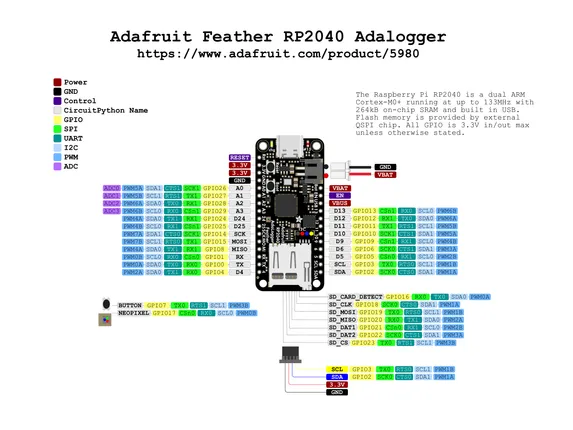

# Feather RP2040 Adalogger

**Adafruit** · RP2040

Revision: Not identified  
Coverage: Pinout image collected

[Browse all manufacturers](../../../../BROWSE.md) · [Desktop app](https://github.com/valleytechsolutions/black-wire-desktop)

## Pinout reference - PDF page 1

**pinout image** · Reviewed source · PNG

[Open original reference](../../../../library/media/ab03c24204c0d0bd07d97838a2f43920e4752289666cbf8b3d3986d2ef6e1e03.png)

**Credit and rights:** Not established; source attribution retained. Source/manufacturer: Adafruit.

[Source 1](https://raw.githubusercontent.com/adafruit/Adafruit-Feather-RP2040-Adalogger-PCB/main/Adafruit Feather RP2040 Adalogger PrettyPins 2.pdf) · [Source 2](https://learn.adafruit.com/adafruit-feather-rp2040-adalogger/pinouts)

 Original PDF page 1 rendered at 220 dpi; no labels changed.

SHA-256: `ab03c24204c0d0bd07d97838a2f43920e4752289666cbf8b3d3986d2ef6e1e03`

## Manufacturer pinout PDF

**original reference PDF** · Reviewed source · PDF

[Open original reference](../../../../library/media/b6a1e582bcdcecf3a76dbd8f73b8e4353fb530fff16aac75dc685db6edc43474.pdf)

**Credit and rights:** Not established; source attribution retained. Source/manufacturer: Adafruit.

[Source 1](https://raw.githubusercontent.com/adafruit/Adafruit-Feather-RP2040-Adalogger-PCB/main/Adafruit Feather RP2040 Adalogger PrettyPins 2.pdf) · [Source 2](https://learn.adafruit.com/adafruit-feather-rp2040-adalogger/pinouts)

SHA-256: `b6a1e582bcdcecf3a76dbd8f73b8e4353fb530fff16aac75dc685db6edc43474`

Pin assignments have not been independently electrically verified. Check board revision before wiring.
