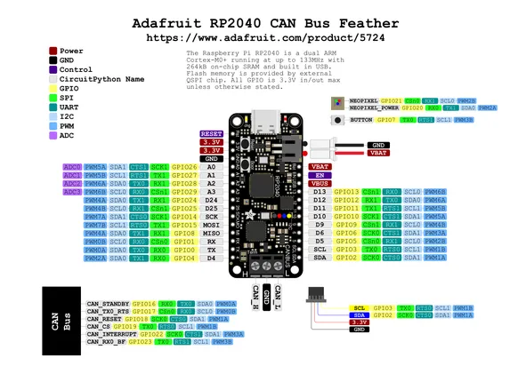

# Feather RP2040 CAN Bus

**Adafruit** · RP2040

Revision: Not identified  
Coverage: Pinout image collected

[Browse all manufacturers](../../../../BROWSE.md) · [Desktop app](https://github.com/valleytechsolutions/black-wire-desktop)

## Pinout reference - PDF page 1

**pinout image** · Reviewed source · PNG

[Open original reference](../../../../library/media/1a8fb17babf11ab79b3db48ef89beb71b481a155f7ea318e9583edfb3344ae66.png)

**Credit and rights:** Not established; source attribution retained. Source/manufacturer: Adafruit.

[Source 1](https://raw.githubusercontent.com/adafruit/Adafruit-RP2040-CAN-Bus-Feather-PCB/main/Adafruit%20RP2040%20CAN%20Bus%20Feather%20PrettyPins_2.pdf) · [Source 2](https://learn.adafruit.com/adafruit-rp2040-can-bus-feather/pinouts)

Discovered from CircuitPython board metadata and the linked product/documentation page. Exact hardware revision requires matching to the diagram. Original PDF page 1 rendered at 220 dpi; no labels changed.

SHA-256: `1a8fb17babf11ab79b3db48ef89beb71b481a155f7ea318e9583edfb3344ae66`

## Physical board pinout

**original reference PDF** · Reviewed source · PDF

[Open original reference](../../../../library/media/d8f8428b36e80a9c4e5dde20f790f895a88eee2d849f260684cd828f842afdfe.pdf)

**Credit and rights:** Not established; source attribution retained. Source/manufacturer: Adafruit.

[Source 1](https://raw.githubusercontent.com/adafruit/Adafruit-RP2040-CAN-Bus-Feather-PCB/main/Adafruit%20RP2040%20CAN%20Bus%20Feather%20PrettyPins_2.pdf) · [Source 2](https://learn.adafruit.com/adafruit-rp2040-can-bus-feather/pinouts)

Discovered from CircuitPython board metadata and the linked product/documentation page. Exact hardware revision requires matching to the diagram.

SHA-256: `d8f8428b36e80a9c4e5dde20f790f895a88eee2d849f260684cd828f842afdfe`

Pin assignments have not been independently electrically verified. Check board revision before wiring.
