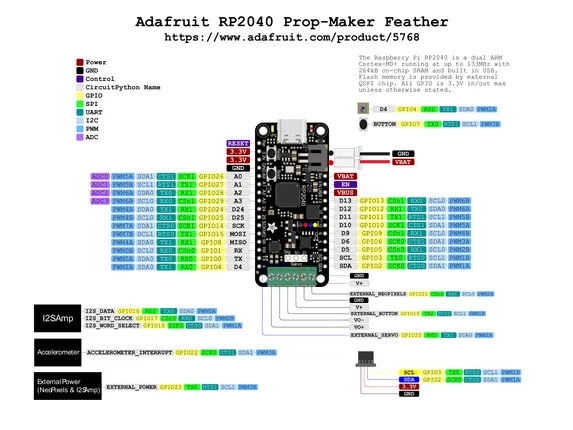

# Feather RP2040 Prop-Maker

**Adafruit** · RP2040

Revision: Not identified  
Coverage: Pinout image collected

[Browse all manufacturers](../../../../BROWSE.md) · [Desktop app](https://github.com/valleytechsolutions/black-wire-desktop)

## Pinout reference - PDF page 1

**pinout image** · Reviewed source · PNG

[Open original reference](../../../../library/media/d0beadf3ff4f9380732cbec60c5f05a4ca4dd789ed6c725a94b69ed3926254c3.png)

**Credit and rights:** Not established; source attribution retained. Source/manufacturer: Adafruit.

[Source 1](https://raw.githubusercontent.com/adafruit/Adafruit-RP2040-Prop-Maker-Feather-PCB/main/Adafruit%20RP2040%20Prop-Maker%20Feather%20PrettyPins.pdf) · [Source 2](https://learn.adafruit.com/adafruit-rp2040-prop-maker-feather/pinouts)

Discovered from CircuitPython board metadata and the linked product/documentation page. Exact hardware revision requires matching to the diagram. Original PDF page 1 rendered at 220 dpi; no labels changed.

SHA-256: `d0beadf3ff4f9380732cbec60c5f05a4ca4dd789ed6c725a94b69ed3926254c3`

## Physical board pinout

**original reference PDF** · Reviewed source · PDF

[Open original reference](../../../../library/media/54a003acbaafa11a883395c2a2d18e2130f6ead488a586f17b764eadafad5d2f.pdf)

**Credit and rights:** Not established; source attribution retained. Source/manufacturer: Adafruit.

[Source 1](https://raw.githubusercontent.com/adafruit/Adafruit-RP2040-Prop-Maker-Feather-PCB/main/Adafruit%20RP2040%20Prop-Maker%20Feather%20PrettyPins.pdf) · [Source 2](https://learn.adafruit.com/adafruit-rp2040-prop-maker-feather/pinouts)

Discovered from CircuitPython board metadata and the linked product/documentation page. Exact hardware revision requires matching to the diagram.

SHA-256: `54a003acbaafa11a883395c2a2d18e2130f6ead488a586f17b764eadafad5d2f`

Pin assignments have not been independently electrically verified. Check board revision before wiring.
