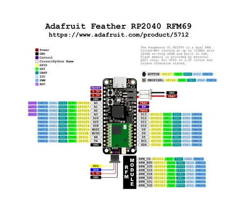

# Feather RP2040 RFM69

**Adafruit** · RP2040

Revision: Not identified  
Coverage: Pinout image collected

[Browse all manufacturers](../../../../BROWSE.md) · [Desktop app](https://github.com/valleytechsolutions/black-wire-desktop)

## Pinout reference - PDF page 1

**pinout image** · Reviewed source · PNG

[Open original reference](../../../../library/media/214e1181f7bf0ccd1820e95bcc90ec00d6ea2cf5f33c0675e3eca997295b8644.png)

**Credit and rights:** Not established; source attribution retained. Source/manufacturer: Adafruit.

[Source 1](https://raw.githubusercontent.com/adafruit/Adafruit-Feather-RP2040-RFM-PCB/main/Adafruit_Feather_RP2040_RFM69_Pinout_2.pdf) · [Source 2](https://learn.adafruit.com/feather-rp2040-rfm69/pinouts)

Discovered from CircuitPython board metadata and the linked product/documentation page. Exact hardware revision requires matching to the diagram. Original PDF page 1 rendered at 220 dpi; no labels changed.

SHA-256: `214e1181f7bf0ccd1820e95bcc90ec00d6ea2cf5f33c0675e3eca997295b8644`

## Physical board pinout

**original reference PDF** · Reviewed source · PDF

[Open original reference](../../../../library/media/ac9be3836ac28165c6c278e2b4fccf6af9cf8f21ff44750a0e16d21e32646427.pdf)

**Credit and rights:** Not established; source attribution retained. Source/manufacturer: Adafruit.

[Source 1](https://raw.githubusercontent.com/adafruit/Adafruit-Feather-RP2040-RFM-PCB/main/Adafruit_Feather_RP2040_RFM69_Pinout_2.pdf) · [Source 2](https://learn.adafruit.com/feather-rp2040-rfm69/pinouts)

Discovered from CircuitPython board metadata and the linked product/documentation page. Exact hardware revision requires matching to the diagram.

SHA-256: `ac9be3836ac28165c6c278e2b4fccf6af9cf8f21ff44750a0e16d21e32646427`

Pin assignments have not been independently electrically verified. Check board revision before wiring.
