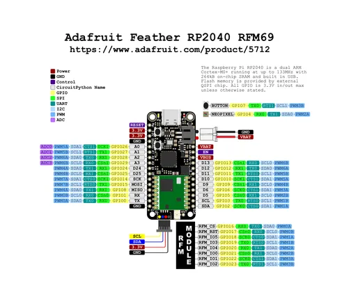

# Feather RP2040 RFM69

**Adafruit** · RP2040

Revision: Not identified

Coverage: Pinout image collected

[Browse all manufacturers](../../../../BROWSE.md) · [Devices & IoT](../../../../DEVICES.md) · [Open in the browser guide](https://valleytech-black-wire-guide.pages.dev/?board=adafruit-rp2040-feather-rp2040-rfm69)

## Datasheets and original documentation

Board datasheet: **not yet recorded**. Visual reference: **available**.

[Manufacturer source (recorded link)](https://learn.adafruit.com/feather-rp2040-rfm69/pinouts)

A chip datasheet, schematic and board datasheet have different scopes. Match the exact hardware revision.

[Documentation coverage and remaining gaps](../../../../DOCUMENTATION.md)

## Pinout reference - PDF page 1

**pinout image** · Reviewed source · PNG

[Open original reference](../../../../library/media/214e1181f7bf0ccd1820e95bcc90ec00d6ea2cf5f33c0675e3eca997295b8644.png)

**Credit and rights:** Not established; source attribution retained. Source/manufacturer: Adafruit.

[Source 1](https://raw.githubusercontent.com/adafruit/Adafruit-Feather-RP2040-RFM-PCB/main/Adafruit_Feather_RP2040_RFM69_Pinout_2.pdf) · [Source 2](https://learn.adafruit.com/feather-rp2040-rfm69/pinouts)

Discovered from CircuitPython board metadata and the linked product/documentation page. Exact hardware revision requires matching to the diagram. Original PDF page 1 rendered at 220 dpi; no labels changed.

Image revision: Not identified

SHA-256: `214e1181f7bf0ccd1820e95bcc90ec00d6ea2cf5f33c0675e3eca997295b8644`

## Physical board pinout

**original reference PDF** · Reviewed source · PDF

[Open original reference](../../../../library/media/ac9be3836ac28165c6c278e2b4fccf6af9cf8f21ff44750a0e16d21e32646427.pdf)

**Credit and rights:** Not established; source attribution retained. Source/manufacturer: Adafruit.

[Source 1](https://raw.githubusercontent.com/adafruit/Adafruit-Feather-RP2040-RFM-PCB/main/Adafruit_Feather_RP2040_RFM69_Pinout_2.pdf) · [Source 2](https://learn.adafruit.com/feather-rp2040-rfm69/pinouts)

Discovered from CircuitPython board metadata and the linked product/documentation page. Exact hardware revision requires matching to the diagram.

Image revision: Not identified

SHA-256: `ac9be3836ac28165c6c278e2b4fccf6af9cf8f21ff44750a0e16d21e32646427`

Pin assignments have not been independently electrically verified. Check board revision before wiring.
