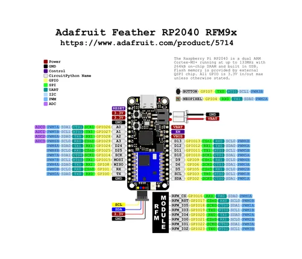

# Feather RP2040 RFM95

**Adafruit** · RP2040

Revision: Not identified  
Coverage: Pinout image collected

[Browse all manufacturers](../../../../BROWSE.md) · [Desktop app](https://github.com/valleytechsolutions/black-wire-desktop)

## Pinout reference - PDF page 1

**pinout image** · Reviewed source · PNG

[Open original reference](../../../../library/media/7658a37ddc8b9659895cc28b1766e7de45e7a9b485e52319f29dcaa24d3df205.png)

**Credit and rights:** Not established; source attribution retained. Source/manufacturer: Adafruit.

[Source 1](https://raw.githubusercontent.com/adafruit/Adafruit-Feather-RP2040-RFM-PCB/main/Adafruit_Feather_RP2040_RFM9x_Pinout_2.pdf) · [Source 2](https://learn.adafruit.com/feather-rp2040-rfm95/pinouts)

 Original PDF page 1 rendered at 220 dpi; no labels changed.

SHA-256: `7658a37ddc8b9659895cc28b1766e7de45e7a9b485e52319f29dcaa24d3df205`

## Manufacturer pinout PDF

**original reference PDF** · Reviewed source · PDF

[Open original reference](../../../../library/media/8ff1e5e690d1147fd2182dbd8d403ac1348d782e3b0bd4a8e0a2d602692ab6a8.pdf)

**Credit and rights:** Not established; source attribution retained. Source/manufacturer: Adafruit.

[Source 1](https://raw.githubusercontent.com/adafruit/Adafruit-Feather-RP2040-RFM-PCB/main/Adafruit_Feather_RP2040_RFM9x_Pinout_2.pdf) · [Source 2](https://learn.adafruit.com/feather-rp2040-rfm95/pinouts)

SHA-256: `8ff1e5e690d1147fd2182dbd8d403ac1348d782e3b0bd4a8e0a2d602692ab6a8`

Pin assignments have not been independently electrically verified. Check board revision before wiring.
