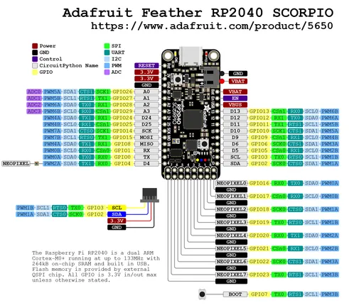

# Feather RP2040 SCORPIO

**Adafruit** · RP2040

Revision: Not identified  
Coverage: Pinout image collected

[Browse all manufacturers](../../../../BROWSE.md) · [Desktop app](https://github.com/valleytechsolutions/black-wire-desktop)

## Physical board pinout

**pinout image** · Reviewed source · PNG

[Open original reference](../../../../library/media/b2cda1e89e510f8899ffac0bbe2518aa368fefdc5501bef63f03bdfe1bed38a6.png)

**Credit and rights:** Not established; source attribution retained. Source/manufacturer: Adafruit.

[Source 1](https://cdn-learn.adafruit.com/assets/assets/000/117/535/original/adafruit_products_feather-rp2040-scorpio-prettypins.png?1673545808) · [Source 2](https://learn.adafruit.com/introducing-feather-rp2040-scorpio/pinouts)

Discovered from CircuitPython board metadata and the linked product/documentation page. Exact hardware revision requires matching to the diagram.

SHA-256: `b2cda1e89e510f8899ffac0bbe2518aa368fefdc5501bef63f03bdfe1bed38a6`

Pin assignments have not been independently electrically verified. Check board revision before wiring.
