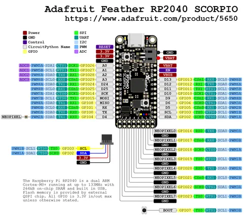

# Feather RP2040 SCORPIO

**Adafruit** · RP2040

Revision: Not identified

Coverage: Pinout image collected

[Browse all manufacturers](../../../../BROWSE.md) · [Devices & IoT](../../../../DEVICES.md) · [Open in the browser guide](https://valleytech-black-wire-guide.pages.dev/?board=adafruit-rp2040-feather-rp2040-scorpio)

## Datasheets and original documentation

Board datasheet: **not yet recorded**. Visual reference: **available**.

[Manufacturer source (recorded link)](https://learn.adafruit.com/introducing-feather-rp2040-scorpio/pinouts)

A chip datasheet, schematic and board datasheet have different scopes. Match the exact hardware revision.

[Documentation coverage and remaining gaps](../../../../DOCUMENTATION.md)

## Physical board pinout

**pinout image** · Reviewed source · PNG

[Open original reference](../../../../library/media/b2cda1e89e510f8899ffac0bbe2518aa368fefdc5501bef63f03bdfe1bed38a6.png)

**Credit and rights:** Not established; source attribution retained. Source/manufacturer: Adafruit.

[Source 1](https://cdn-learn.adafruit.com/assets/assets/000/117/535/original/adafruit_products_feather-rp2040-scorpio-prettypins.png?1673545808) · [Source 2](https://learn.adafruit.com/introducing-feather-rp2040-scorpio/pinouts)

Discovered from CircuitPython board metadata and the linked product/documentation page. Exact hardware revision requires matching to the diagram.

Image revision: Not identified

SHA-256: `b2cda1e89e510f8899ffac0bbe2518aa368fefdc5501bef63f03bdfe1bed38a6`

Pin assignments have not been independently electrically verified. Check board revision before wiring.
