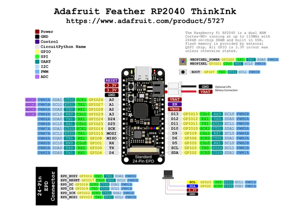

# Feather RP2040 ThinkInk

**Adafruit** · RP2040

Revision: Not identified  
Coverage: Pinout image collected

[Browse all manufacturers](../../../../BROWSE.md) · [Desktop app](https://github.com/valleytechsolutions/black-wire-desktop)

## Pinout reference - PDF page 1

**pinout image** · Reviewed source · PNG

[Open original reference](../../../../library/media/f805c0073a4c2b55634b6be9a0d44410148ad4b2772f2543d78b2b50bc9d8be2.png)

**Credit and rights:** Not established; source attribution retained. Source/manufacturer: Adafruit.

[Source 1](https://raw.githubusercontent.com/adafruit/Adafruit-Feather-RP2040-ThinkInk/main/Adafruit%20Feather%20RP2040%20ThinkInk%20PrettyPins%202.pdf) · [Source 2](https://learn.adafruit.com/adafruit-rp2040-feather-thinkink/pinouts)

Discovered from CircuitPython board metadata and the linked product/documentation page. Exact hardware revision requires matching to the diagram. Original PDF page 1 rendered at 220 dpi; no labels changed.

SHA-256: `f805c0073a4c2b55634b6be9a0d44410148ad4b2772f2543d78b2b50bc9d8be2`

## Physical board pinout

**original reference PDF** · Reviewed source · PDF

[Open original reference](../../../../library/media/040da6b0c66831af723f5f22f345ee8acabb24a9ec71f9440d91d7851d0d1198.pdf)

**Credit and rights:** Not established; source attribution retained. Source/manufacturer: Adafruit.

[Source 1](https://raw.githubusercontent.com/adafruit/Adafruit-Feather-RP2040-ThinkInk/main/Adafruit%20Feather%20RP2040%20ThinkInk%20PrettyPins%202.pdf) · [Source 2](https://learn.adafruit.com/adafruit-rp2040-feather-thinkink/pinouts)

Discovered from CircuitPython board metadata and the linked product/documentation page. Exact hardware revision requires matching to the diagram.

SHA-256: `040da6b0c66831af723f5f22f345ee8acabb24a9ec71f9440d91d7851d0d1198`

Pin assignments have not been independently electrically verified. Check board revision before wiring.
