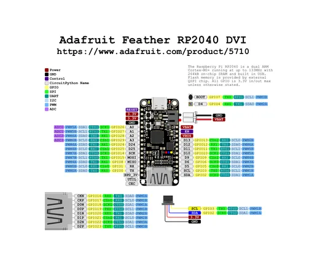

# Feather RP2040 with DVI Output Port

**Adafruit** · RP2040

Revision: Not identified  
Coverage: Pinout image collected

[Browse all manufacturers](../../../../BROWSE.md) · [Desktop app](https://github.com/valleytechsolutions/black-wire-desktop)

## Pinout reference - PDF page 1

**pinout image** · Reviewed source · PNG

[Open original reference](../../../../library/media/35ca7b76f7784e0fb1529b47bc5a596d735c2620957951f6aa91ea4033fe1ebb.png)

**Credit and rights:** Not established; source attribution retained. Source/manufacturer: Adafruit.

[Source 1](https://raw.githubusercontent.com/adafruit/Adafruit-Feather-RP2040-DVI-PCB/main/Adafruit_Feather_RP2040_DVI_Pinout_2.pdf) · [Source 2](https://learn.adafruit.com/adafruit-feather-rp2040-dvi/pinouts)

Discovered from CircuitPython board metadata and the linked product/documentation page. Exact hardware revision requires matching to the diagram. Original PDF page 1 rendered at 220 dpi; no labels changed.

SHA-256: `35ca7b76f7784e0fb1529b47bc5a596d735c2620957951f6aa91ea4033fe1ebb`

## Physical board pinout

**original reference PDF** · Reviewed source · PDF

[Open original reference](../../../../library/media/7e82cfbbdcab1e1fee9b1780cc979303534484ecfb244a4fbf0177ff76d1b77d.pdf)

**Credit and rights:** Not established; source attribution retained. Source/manufacturer: Adafruit.

[Source 1](https://raw.githubusercontent.com/adafruit/Adafruit-Feather-RP2040-DVI-PCB/main/Adafruit_Feather_RP2040_DVI_Pinout_2.pdf) · [Source 2](https://learn.adafruit.com/adafruit-feather-rp2040-dvi/pinouts)

Discovered from CircuitPython board metadata and the linked product/documentation page. Exact hardware revision requires matching to the diagram.

SHA-256: `7e82cfbbdcab1e1fee9b1780cc979303534484ecfb244a4fbf0177ff76d1b77d`

Pin assignments have not been independently electrically verified. Check board revision before wiring.
