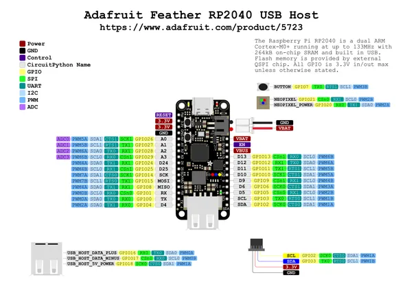

# Feather RP2040 with USB Type A Host

**Adafruit** · RP2040

Revision: Not identified  
Coverage: Pinout image collected

[Browse all manufacturers](../../../../BROWSE.md) · [Desktop app](https://github.com/valleytechsolutions/black-wire-desktop)

## Pinout reference - PDF page 1

**pinout image** · Reviewed source · PNG

[Open original reference](../../../../library/media/86c3f45c5180e1c4b35e70ae7b5e7e40bfafc4ae6b384f3d93395163606d21fb.png)

**Credit and rights:** Not established; source attribution retained. Source/manufacturer: Adafruit.

[Source 1](https://raw.githubusercontent.com/adafruit/Adafruit-Feather-RP2040-USB-Host-PCB/main/Adafruit_Feather_RP2040_USB_Host_PrettyPins_2.pdf) · [Source 2](https://learn.adafruit.com/adafruit-feather-rp2040-with-usb-type-a-host/pinouts)

Discovered from CircuitPython board metadata and the linked product/documentation page. Exact hardware revision requires matching to the diagram. Original PDF page 1 rendered at 220 dpi; no labels changed.

SHA-256: `86c3f45c5180e1c4b35e70ae7b5e7e40bfafc4ae6b384f3d93395163606d21fb`

## Physical board pinout

**original reference PDF** · Reviewed source · PDF

[Open original reference](../../../../library/media/de763ccd0ff7777325402d96c88a53d81d1461cf3f592085c81e34d65d322057.pdf)

**Credit and rights:** Not established; source attribution retained. Source/manufacturer: Adafruit.

[Source 1](https://raw.githubusercontent.com/adafruit/Adafruit-Feather-RP2040-USB-Host-PCB/main/Adafruit_Feather_RP2040_USB_Host_PrettyPins_2.pdf) · [Source 2](https://learn.adafruit.com/adafruit-feather-rp2040-with-usb-type-a-host/pinouts)

Discovered from CircuitPython board metadata and the linked product/documentation page. Exact hardware revision requires matching to the diagram.

SHA-256: `de763ccd0ff7777325402d96c88a53d81d1461cf3f592085c81e34d65d322057`

Pin assignments have not been independently electrically verified. Check board revision before wiring.
