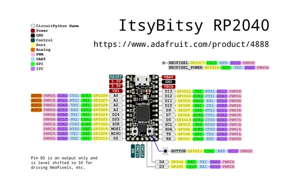

# ItsyBitsy RP2040

**Adafruit** · RP2040

Revision: Not identified  
Coverage: Pinout image collected

[Browse all manufacturers](../../../../BROWSE.md) · [Desktop app](https://github.com/valleytechsolutions/black-wire-desktop)

## Pinout reference - PDF page 1

**pinout image** · Reviewed source · PNG

[Open original reference](../../../../library/media/57c122ed243f4f5ddc4b1421641e27f58707b884063e0809cac2516859cf3dc0.png)

**Credit and rights:** Not established; source attribution retained. Source/manufacturer: Adafruit.

[Source 1](https://raw.githubusercontent.com/adafruit/Adafruit-ItsyBitsy-RP2040-PCB/main/Adafruit ItsyBitsy RP2040 pinout.pdf) · [Source 2](https://learn.adafruit.com/adafruit-itsybitsy-rp2040/pinouts)

 Original PDF page 1 rendered at 220 dpi; no labels changed.

SHA-256: `57c122ed243f4f5ddc4b1421641e27f58707b884063e0809cac2516859cf3dc0`

## Manufacturer pinout PDF

**original reference PDF** · Reviewed source · PDF

[Open original reference](../../../../library/media/136e7de75fa88aa48d68861c12b757ede3f8aad5d9a533f2b98b2b0cda743738.pdf)

**Credit and rights:** Not established; source attribution retained. Source/manufacturer: Adafruit.

[Source 1](https://raw.githubusercontent.com/adafruit/Adafruit-ItsyBitsy-RP2040-PCB/main/Adafruit ItsyBitsy RP2040 pinout.pdf) · [Source 2](https://learn.adafruit.com/adafruit-itsybitsy-rp2040/pinouts)

SHA-256: `136e7de75fa88aa48d68861c12b757ede3f8aad5d9a533f2b98b2b0cda743738`

Pin assignments have not been independently electrically verified. Check board revision before wiring.
