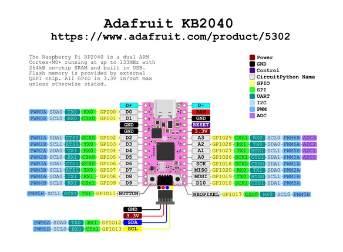

# KB2040

**Adafruit** · RP2040

Revision: Not identified  
Coverage: Pinout image collected

[Browse all manufacturers](../../../../BROWSE.md) · [Desktop app](https://github.com/valleytechsolutions/black-wire-desktop)

## Pinout reference - PDF page 1

**pinout image** · Reviewed source · PNG

[Open original reference](../../../../library/media/bbc05ed4cbc3f0527c631ade6b8ce052380dfc73ff112e8ba4577bde2eb034e2.png)

**Credit and rights:** Not established; source attribution retained. Source/manufacturer: Adafruit.

[Source 1](https://raw.githubusercontent.com/adafruit/Adafruit-KB2040-PCB/main/Adafruit KB2040 Pinout.pdf) · [Source 2](https://learn.adafruit.com/adafruit-kb2040/pinouts)

 Original PDF page 1 rendered at 220 dpi; no labels changed.

SHA-256: `bbc05ed4cbc3f0527c631ade6b8ce052380dfc73ff112e8ba4577bde2eb034e2`

## Manufacturer pinout PDF

**original reference PDF** · Reviewed source · PDF

[Open original reference](../../../../library/media/059e3360a7ba2c674ee4598a49d80054c4689763246c1c88659dab2f71dc6d25.pdf)

**Credit and rights:** Not established; source attribution retained. Source/manufacturer: Adafruit.

[Source 1](https://raw.githubusercontent.com/adafruit/Adafruit-KB2040-PCB/main/Adafruit KB2040 Pinout.pdf) · [Source 2](https://learn.adafruit.com/adafruit-kb2040/pinouts)

SHA-256: `059e3360a7ba2c674ee4598a49d80054c4689763246c1c88659dab2f71dc6d25`

Pin assignments have not been independently electrically verified. Check board revision before wiring.
