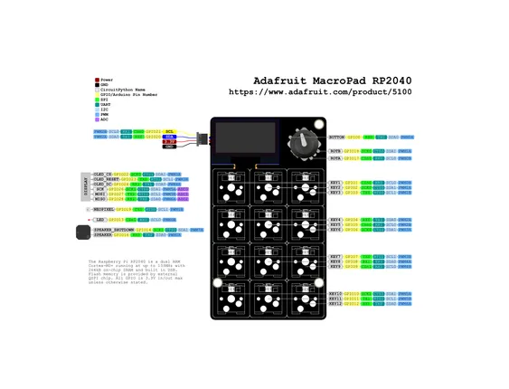

# MacroPad RP2040

**Adafruit** · RP2040

Revision: Not identified  
Coverage: Pinout image collected

[Browse all manufacturers](../../../../BROWSE.md) · [Desktop app](https://github.com/valleytechsolutions/black-wire-desktop)

## Pinout reference - PDF page 1

**pinout image** · Reviewed source · PNG

[Open original reference](../../../../library/media/05073125a36c45c48a392181a837ca95ee1bd28285029d8e6706f5a8e113e4df.png)

**Credit and rights:** Not established; source attribution retained. Source/manufacturer: Adafruit.

[Source 1](https://raw.githubusercontent.com/adafruit/Adafruit-MacroPad-RP2040-PCB/main/Adafruit%20MacroPad%20RP2040%20Pinout.pdf) · [Source 2](https://learn.adafruit.com/adafruit-macropad-rp2040/pinouts)

Discovered from CircuitPython board metadata and the linked product/documentation page. Exact hardware revision requires matching to the diagram. Original PDF page 1 rendered at 220 dpi; no labels changed.

SHA-256: `05073125a36c45c48a392181a837ca95ee1bd28285029d8e6706f5a8e113e4df`

## Physical board pinout

**original reference PDF** · Reviewed source · PDF

[Open original reference](../../../../library/media/64903809c32000bf6c080f3de745a0979a5abf061607d67d156920b933c6e5f5.pdf)

**Credit and rights:** Not established; source attribution retained. Source/manufacturer: Adafruit.

[Source 1](https://raw.githubusercontent.com/adafruit/Adafruit-MacroPad-RP2040-PCB/main/Adafruit%20MacroPad%20RP2040%20Pinout.pdf) · [Source 2](https://learn.adafruit.com/adafruit-macropad-rp2040/pinouts)

Discovered from CircuitPython board metadata and the linked product/documentation page. Exact hardware revision requires matching to the diagram.

SHA-256: `64903809c32000bf6c080f3de745a0979a5abf061607d67d156920b933c6e5f5`

Pin assignments have not been independently electrically verified. Check board revision before wiring.
