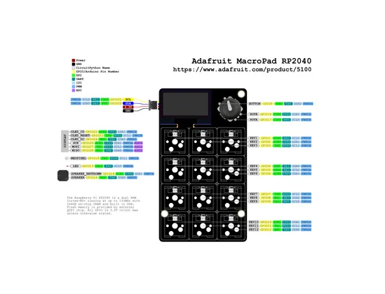

# MacroPad RP2040

**Adafruit** · RP2040

Revision: Not identified

Coverage: Pinout image collected

[Browse all manufacturers](../../../../BROWSE.md) · [Devices & IoT](../../../../DEVICES.md) · [Open in the browser guide](https://valleytech-black-wire-guide.pages.dev/?board=adafruit-rp2040-macropad-rp2040)

## Datasheets and original documentation

Board datasheet: **not yet recorded**. Visual reference: **available**.

[Manufacturer source (recorded link)](https://learn.adafruit.com/adafruit-macropad-rp2040/pinouts)

A chip datasheet, schematic and board datasheet have different scopes. Match the exact hardware revision.

[Documentation coverage and remaining gaps](../../../../DOCUMENTATION.md)

## Pinout reference - PDF page 1

**pinout image** · Reviewed source · PNG

[Open original reference](../../../../library/media/05073125a36c45c48a392181a837ca95ee1bd28285029d8e6706f5a8e113e4df.png)

**Credit and rights:** Not established; source attribution retained. Source/manufacturer: Adafruit.

[Source 1](https://raw.githubusercontent.com/adafruit/Adafruit-MacroPad-RP2040-PCB/main/Adafruit%20MacroPad%20RP2040%20Pinout.pdf) · [Source 2](https://learn.adafruit.com/adafruit-macropad-rp2040/pinouts)

Discovered from CircuitPython board metadata and the linked product/documentation page. Exact hardware revision requires matching to the diagram. Original PDF page 1 rendered at 220 dpi; no labels changed.

Image revision: Not identified

SHA-256: `05073125a36c45c48a392181a837ca95ee1bd28285029d8e6706f5a8e113e4df`

## Physical board pinout

**original reference PDF** · Reviewed source · PDF

[Open original reference](../../../../library/media/64903809c32000bf6c080f3de745a0979a5abf061607d67d156920b933c6e5f5.pdf)

**Credit and rights:** Not established; source attribution retained. Source/manufacturer: Adafruit.

[Source 1](https://raw.githubusercontent.com/adafruit/Adafruit-MacroPad-RP2040-PCB/main/Adafruit%20MacroPad%20RP2040%20Pinout.pdf) · [Source 2](https://learn.adafruit.com/adafruit-macropad-rp2040/pinouts)

Discovered from CircuitPython board metadata and the linked product/documentation page. Exact hardware revision requires matching to the diagram.

Image revision: Not identified

SHA-256: `64903809c32000bf6c080f3de745a0979a5abf061607d67d156920b933c6e5f5`

Pin assignments have not been independently electrically verified. Check board revision before wiring.
