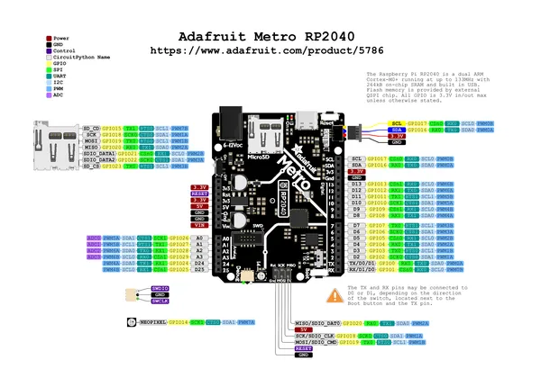

# Metro RP2040

**Adafruit** · RP2040

Revision: Not identified  
Coverage: Pinout image collected

[Browse all manufacturers](../../../../BROWSE.md) · [Desktop app](https://github.com/valleytechsolutions/black-wire-desktop)

## Pinout reference - PDF page 1

**pinout image** · Reviewed source · PNG

[Open original reference](../../../../library/media/de77238327dad0a1a26a228505b605adb6d9ec6960c65ef97197d654edf837bf.png)

**Credit and rights:** Not established; source attribution retained. Source/manufacturer: Adafruit.

[Source 1](https://raw.githubusercontent.com/adafruit/Adafruit-Metro-RP2040-PCB/main/Adafruit Metro RP2040 Pinout.pdf) · [Source 2](https://learn.adafruit.com/adafruit-metro-rp2040/pinouts)

 Original PDF page 1 rendered at 220 dpi; no labels changed.

SHA-256: `de77238327dad0a1a26a228505b605adb6d9ec6960c65ef97197d654edf837bf`

## Manufacturer pinout PDF

**original reference PDF** · Reviewed source · PDF

[Open original reference](../../../../library/media/9d6a74e8a66f9dac76a817f7c6ac0192f98f234de2ff022703e39cc37d741ea2.pdf)

**Credit and rights:** Not established; source attribution retained. Source/manufacturer: Adafruit.

[Source 1](https://raw.githubusercontent.com/adafruit/Adafruit-Metro-RP2040-PCB/main/Adafruit Metro RP2040 Pinout.pdf) · [Source 2](https://learn.adafruit.com/adafruit-metro-rp2040/pinouts)

SHA-256: `9d6a74e8a66f9dac76a817f7c6ac0192f98f234de2ff022703e39cc37d741ea2`

Pin assignments have not been independently electrically verified. Check board revision before wiring.
