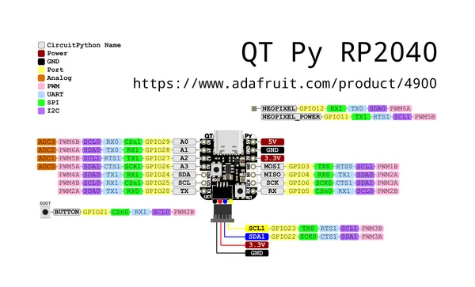

# QT Py RP2040

**Adafruit** · RP2040

Revision: Not identified  
Coverage: Pinout image collected

[Browse all manufacturers](../../../../BROWSE.md) · [Desktop app](https://github.com/valleytechsolutions/black-wire-desktop)

## Pinout reference - PDF page 1

**pinout image** · Reviewed source · PNG

[Open original reference](../../../../library/media/f6740910eaad268d00f9cce2e664c79dc5ad4b6b459e33c69d5e6bc8c361066f.png)

**Credit and rights:** Not established; source attribution retained. Source/manufacturer: Adafruit.

[Source 1](https://raw.githubusercontent.com/adafruit/Adafruit-QT-Py-RP2040-PCB/main/Adafruit QT Py RP2040 Pinout.pdf) · [Source 2](https://learn.adafruit.com/adafruit-qt-py-2040/pinouts)

 Original PDF page 1 rendered at 220 dpi; no labels changed.

SHA-256: `f6740910eaad268d00f9cce2e664c79dc5ad4b6b459e33c69d5e6bc8c361066f`

## Manufacturer pinout PDF

**original reference PDF** · Reviewed source · PDF

[Open original reference](../../../../library/media/c4c0d0734aa6eb535b4462a9471a0a7f418126b59e86ef47da36a3714b5afb91.pdf)

**Credit and rights:** Not established; source attribution retained. Source/manufacturer: Adafruit.

[Source 1](https://raw.githubusercontent.com/adafruit/Adafruit-QT-Py-RP2040-PCB/main/Adafruit QT Py RP2040 Pinout.pdf) · [Source 2](https://learn.adafruit.com/adafruit-qt-py-2040/pinouts)

SHA-256: `c4c0d0734aa6eb535b4462a9471a0a7f418126b59e86ef47da36a3714b5afb91`

Pin assignments have not been independently electrically verified. Check board revision before wiring.
