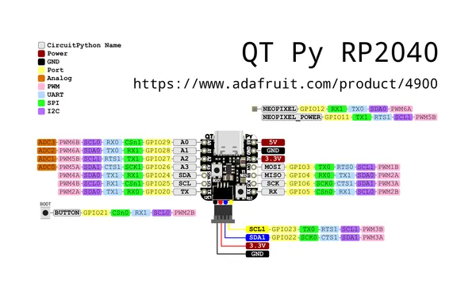

# QT Py RP2040

**Adafruit** · RP2040

Revision: Not identified

Coverage: Pinout image collected

[Browse all manufacturers](../../../../BROWSE.md) · [Devices & IoT](../../../../DEVICES.md) · [Open in the browser guide](https://valleytech-black-wire-guide.pages.dev/?board=adafruit-rp2040-qt-py-rp2040)

## Datasheets and original documentation

Board datasheet: **not yet recorded**. Visual reference: **available**.

[Manufacturer source (recorded link)](https://learn.adafruit.com/adafruit-qt-py-2040/pinouts)

A chip datasheet, schematic and board datasheet have different scopes. Match the exact hardware revision.

[Documentation coverage and remaining gaps](../../../../DOCUMENTATION.md)

## Pinout reference - PDF page 1

**pinout image** · Reviewed source · PNG

[Open original reference](../../../../library/media/f6740910eaad268d00f9cce2e664c79dc5ad4b6b459e33c69d5e6bc8c361066f.png)

**Credit and rights:** Not established; source attribution retained. Source/manufacturer: Adafruit.

[Source 1](https://raw.githubusercontent.com/adafruit/Adafruit-QT-Py-RP2040-PCB/main/Adafruit QT Py RP2040 Pinout.pdf) · [Source 2](https://learn.adafruit.com/adafruit-qt-py-2040/pinouts)

 Original PDF page 1 rendered at 220 dpi; no labels changed.

Image revision: Not identified

SHA-256: `f6740910eaad268d00f9cce2e664c79dc5ad4b6b459e33c69d5e6bc8c361066f`

## Manufacturer pinout PDF

**original reference PDF** · Reviewed source · PDF

[Open original reference](../../../../library/media/c4c0d0734aa6eb535b4462a9471a0a7f418126b59e86ef47da36a3714b5afb91.pdf)

**Credit and rights:** Not established; source attribution retained. Source/manufacturer: Adafruit.

[Source 1](https://raw.githubusercontent.com/adafruit/Adafruit-QT-Py-RP2040-PCB/main/Adafruit QT Py RP2040 Pinout.pdf) · [Source 2](https://learn.adafruit.com/adafruit-qt-py-2040/pinouts)

Image revision: Not identified

SHA-256: `c4c0d0734aa6eb535b4462a9471a0a7f418126b59e86ef47da36a3714b5afb91`

Pin assignments have not been independently electrically verified. Check board revision before wiring.
