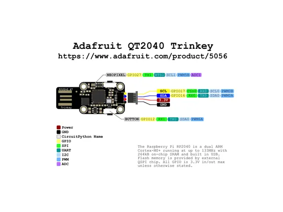

# Trinkey QT2040

**Adafruit** · RP2040

Revision: Not identified  
Coverage: Pinout image collected

[Browse all manufacturers](../../../../BROWSE.md) · [Desktop app](https://github.com/valleytechsolutions/black-wire-desktop)

## Pinout reference - PDF page 1

**pinout image** · Reviewed source · PNG

[Open original reference](../../../../library/media/0f098d6564c04fa421e1ee09565fa0635a9ceae3590fa1e4fb44b10fb4894a72.png)

**Credit and rights:** Not established; source attribution retained. Source/manufacturer: Adafruit.

[Source 1](https://raw.githubusercontent.com/adafruit/Adafruit-Trinkey-QT2040-PCB/main/Adafruit%20Trinkey%20QT2040%20Pinout.pdf) · [Source 2](https://learn.adafruit.com/adafruit-trinkey-qt2040/pinouts)

Discovered from CircuitPython board metadata and the linked product/documentation page. Exact hardware revision requires matching to the diagram. Original PDF page 1 rendered at 220 dpi; no labels changed.

SHA-256: `0f098d6564c04fa421e1ee09565fa0635a9ceae3590fa1e4fb44b10fb4894a72`

## Physical board pinout

**original reference PDF** · Reviewed source · PDF

[Open original reference](../../../../library/media/73d7eccd3aa9bb1d3a1e7868f6eebe8ea33020333ee75f64c0ca034f9c9e7be7.pdf)

**Credit and rights:** Not established; source attribution retained. Source/manufacturer: Adafruit.

[Source 1](https://raw.githubusercontent.com/adafruit/Adafruit-Trinkey-QT2040-PCB/main/Adafruit%20Trinkey%20QT2040%20Pinout.pdf) · [Source 2](https://learn.adafruit.com/adafruit-trinkey-qt2040/pinouts)

Discovered from CircuitPython board metadata and the linked product/documentation page. Exact hardware revision requires matching to the diagram.

SHA-256: `73d7eccd3aa9bb1d3a1e7868f6eebe8ea33020333ee75f64c0ca034f9c9e7be7`

Pin assignments have not been independently electrically verified. Check board revision before wiring.
