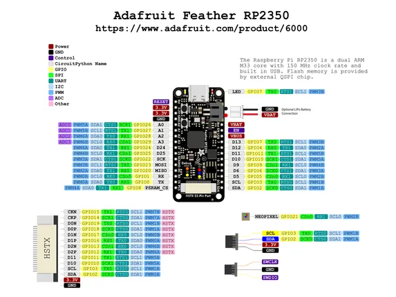

# Feather RP2350

**Adafruit** · RP2350

Revision: Not identified  
Coverage: Pinout image collected

[Browse all manufacturers](../../../../BROWSE.md) · [Desktop app](https://github.com/valleytechsolutions/black-wire-desktop)

## Pinout reference - PDF page 1

**pinout image** · Reviewed source · PNG

[Open original reference](../../../../library/media/d99f27827b1ae75d086e5c9889c649f15751376cf1a7f2af61e33e80671bfe1b.png)

**Credit and rights:** Not established; source attribution retained. Source/manufacturer: Adafruit.

[Source 1](https://raw.githubusercontent.com/adafruit/Adafruit-Feather-RP2350-PCB/main/Adafruit_Feather_RP2350_prettypins 2.pdf) · [Source 2](https://learn.adafruit.com/adafruit-feather-rp2350/pinouts)

 Original PDF page 1 rendered at 220 dpi; no labels changed.

SHA-256: `d99f27827b1ae75d086e5c9889c649f15751376cf1a7f2af61e33e80671bfe1b`

## Manufacturer pinout PDF

**original reference PDF** · Reviewed source · PDF

[Open original reference](../../../../library/media/0c70fd8672c312c728c21869b5f72da8ea36a0146c4cb09ff668143429c0e29b.pdf)

**Credit and rights:** Not established; source attribution retained. Source/manufacturer: Adafruit.

[Source 1](https://raw.githubusercontent.com/adafruit/Adafruit-Feather-RP2350-PCB/main/Adafruit_Feather_RP2350_prettypins 2.pdf) · [Source 2](https://learn.adafruit.com/adafruit-feather-rp2350/pinouts)

SHA-256: `0c70fd8672c312c728c21869b5f72da8ea36a0146c4cb09ff668143429c0e29b`

Pin assignments have not been independently electrically verified. Check board revision before wiring.
