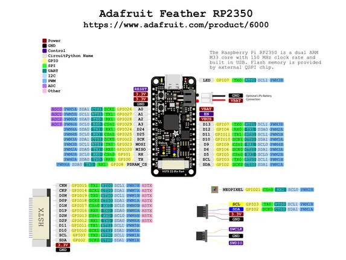

# Feather RP2350

**Adafruit** · RP2350

Revision: Not identified

Coverage: Pinout image collected

[Browse all manufacturers](../../../../BROWSE.md) · [Devices & IoT](../../../../DEVICES.md) · [Open in the browser guide](https://valleytech-black-wire-guide.pages.dev/?board=adafruit-rp2350-feather-rp2350)

## Datasheets and original documentation

Board datasheet: **not yet recorded**. Visual reference: **available**.

[Manufacturer source (recorded link)](https://learn.adafruit.com/adafruit-feather-rp2350/pinouts)

A chip datasheet, schematic and board datasheet have different scopes. Match the exact hardware revision.

[Documentation coverage and remaining gaps](../../../../DOCUMENTATION.md)

## Pinout reference - PDF page 1

**pinout image** · Reviewed source · PNG

[Open original reference](../../../../library/media/d99f27827b1ae75d086e5c9889c649f15751376cf1a7f2af61e33e80671bfe1b.png)

**Credit and rights:** Not established; source attribution retained. Source/manufacturer: Adafruit.

[Source 1](https://raw.githubusercontent.com/adafruit/Adafruit-Feather-RP2350-PCB/main/Adafruit_Feather_RP2350_prettypins 2.pdf) · [Source 2](https://learn.adafruit.com/adafruit-feather-rp2350/pinouts)

 Original PDF page 1 rendered at 220 dpi; no labels changed.

Image revision: Not identified

SHA-256: `d99f27827b1ae75d086e5c9889c649f15751376cf1a7f2af61e33e80671bfe1b`

## Manufacturer pinout PDF

**original reference PDF** · Reviewed source · PDF

[Open original reference](../../../../library/media/0c70fd8672c312c728c21869b5f72da8ea36a0146c4cb09ff668143429c0e29b.pdf)

**Credit and rights:** Not established; source attribution retained. Source/manufacturer: Adafruit.

[Source 1](https://raw.githubusercontent.com/adafruit/Adafruit-Feather-RP2350-PCB/main/Adafruit_Feather_RP2350_prettypins 2.pdf) · [Source 2](https://learn.adafruit.com/adafruit-feather-rp2350/pinouts)

Image revision: Not identified

SHA-256: `0c70fd8672c312c728c21869b5f72da8ea36a0146c4cb09ff668143429c0e29b`

Pin assignments have not been independently electrically verified. Check board revision before wiring.
