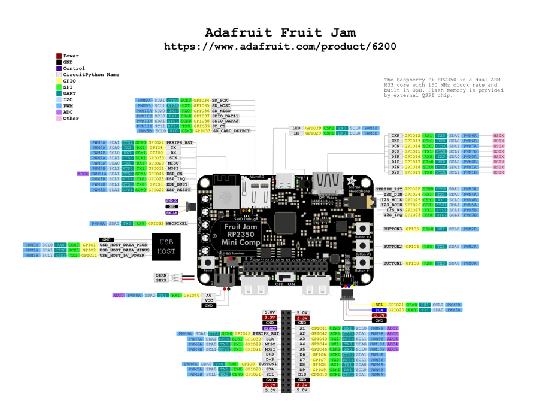

# Fruit Jam - Mini RP2350 Computer

**Adafruit** · RP2350

Revision: Not identified

Coverage: Physical pinout source collected; scope and revision require confirmation

[Browse all manufacturers](../../../../BROWSE.md) · [Devices & IoT](../../../../DEVICES.md) · [Open in the browser guide](https://valleytech-black-wire-guide.pages.dev/?board=adafruit-rp2350-fruit-jam-mini-rp2350-computer)

Architecture: **ARM / RISC-V**

## Specifications and hardware documentation

- [Specifications & hardware guide](https://www.adafruit.com/product/6200)

## Original manufacturer graphical reference (PDF)

**original reference PDF** · Reviewed source · PDF

[Open original reference](../../../../library/media/2d37de153f134a6270765660446fc69485fd72b26547cf6e52360bed5b7dd16d.pdf)

**Credit and rights:** Adafruit / original diagram contributors. Rights not established for this asset; attribution retained. Original artwork is not covered by Black Wire's editorial license.. Source/manufacturer: Adafruit.

[Source 1](https://raw.githubusercontent.com/adafruit/Adafruit-Fruit-Jam-PCB/252dc09456ee447b3d7eeb4fa99877898503e81a/Adafruit_Fruit_Jam_PrettyPins.pdf) · [Source 2](https://www.adafruit.com/product/6200) · [Source 3](https://circuitpython.org/board/adafruit_fruit_jam/) · [Source 4](https://github.com/adafruit/Adafruit-Fruit-Jam-PCB/tree/252dc09456ee447b3d7eeb4fa99877898503e81a)

Original publisher reference. Exact board/revision and electrical limits still require confirmation.

Image revision: Not identified

SHA-256: `2d37de153f134a6270765660446fc69485fd72b26547cf6e52360bed5b7dd16d`

## Manufacturer board pinout — page 1

**pinout image** · Reviewed source · PNG

[Open original reference](../../../../library/media/ee87d75b87aad2381b550f281df4086935528f36246a2c7daeac49eef8b18916.png)

**Credit and rights:** Adafruit / original diagram contributors. Rights not established for this asset; attribution retained. Original artwork is not covered by Black Wire's editorial license.. Source/manufacturer: Adafruit.

[Source 1](https://raw.githubusercontent.com/adafruit/Adafruit-Fruit-Jam-PCB/252dc09456ee447b3d7eeb4fa99877898503e81a/Adafruit_Fruit_Jam_PrettyPins.pdf) · [Source 2](https://www.adafruit.com/product/6200) · [Source 3](https://circuitpython.org/board/adafruit_fruit_jam/) · [Source 4](https://github.com/adafruit/Adafruit-Fruit-Jam-PCB/tree/252dc09456ee447b3d7eeb4fa99877898503e81a)

Original publisher reference. Exact board/revision and electrical limits still require confirmation.  PDF page rendered at 144 dpi without changing labels. Original vector PDF retained.

Image revision: Not identified

SHA-256: `ee87d75b87aad2381b550f281df4086935528f36246a2c7daeac49eef8b18916`

Pin assignments have not been independently electrically verified. Check board revision before wiring.
