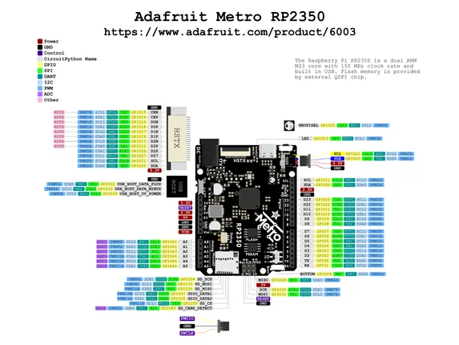

# Metro RP2350

**Adafruit** · RP2350

Revision: Not identified  
Coverage: Pinout image collected

[Browse all manufacturers](../../../../BROWSE.md) · [Desktop app](https://github.com/valleytechsolutions/black-wire-desktop)

## Pinout reference - PDF page 1

**pinout image** · Reviewed source · PNG

[Open original reference](../../../../library/media/9b50b032ccf3b28dd66bbb0b0ac1488269164ef37729d1251d4e98e0a5acfe8b.png)

**Credit and rights:** Not established; source attribution retained. Source/manufacturer: Adafruit.

[Source 1](https://raw.githubusercontent.com/adafruit/Adafruit-Metro-RP2350-PCB/main/Adafruit Metro RP2350 PrettyPins.pdf) · [Source 2](https://learn.adafruit.com/adafruit-metro-rp2350/pinouts)

 Original PDF page 1 rendered at 220 dpi; no labels changed.

SHA-256: `9b50b032ccf3b28dd66bbb0b0ac1488269164ef37729d1251d4e98e0a5acfe8b`

## Manufacturer pinout PDF

**original reference PDF** · Reviewed source · PDF

[Open original reference](../../../../library/media/f2ae4a45d1168e95b6876da18a880f18e70886d80626894b56a90366faa0ed54.pdf)

**Credit and rights:** Not established; source attribution retained. Source/manufacturer: Adafruit.

[Source 1](https://raw.githubusercontent.com/adafruit/Adafruit-Metro-RP2350-PCB/main/Adafruit Metro RP2350 PrettyPins.pdf) · [Source 2](https://learn.adafruit.com/adafruit-metro-rp2350/pinouts)

SHA-256: `f2ae4a45d1168e95b6876da18a880f18e70886d80626894b56a90366faa0ed54`

Pin assignments have not been independently electrically verified. Check board revision before wiring.
