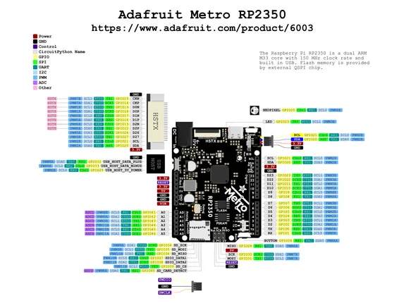

# Metro RP2350

**Adafruit** · RP2350

Revision: Not identified

Coverage: Pinout image collected

[Browse all manufacturers](../../../../BROWSE.md) · [Devices & IoT](../../../../DEVICES.md) · [Open in the browser guide](https://valleytech-black-wire-guide.pages.dev/?board=adafruit-rp2350-metro-rp2350)

## Datasheets and original documentation

Board datasheet: **not yet recorded**. Visual reference: **available**.

[Manufacturer source (recorded link)](https://learn.adafruit.com/adafruit-metro-rp2350/pinouts)

A chip datasheet, schematic and board datasheet have different scopes. Match the exact hardware revision.

[Documentation coverage and remaining gaps](../../../../DOCUMENTATION.md)

## Pinout reference - PDF page 1

**pinout image** · Reviewed source · PNG

[Open original reference](../../../../library/media/9b50b032ccf3b28dd66bbb0b0ac1488269164ef37729d1251d4e98e0a5acfe8b.png)

**Credit and rights:** Not established; source attribution retained. Source/manufacturer: Adafruit.

[Source 1](https://raw.githubusercontent.com/adafruit/Adafruit-Metro-RP2350-PCB/main/Adafruit Metro RP2350 PrettyPins.pdf) · [Source 2](https://learn.adafruit.com/adafruit-metro-rp2350/pinouts)

 Original PDF page 1 rendered at 220 dpi; no labels changed.

Image revision: Not identified

SHA-256: `9b50b032ccf3b28dd66bbb0b0ac1488269164ef37729d1251d4e98e0a5acfe8b`

## Manufacturer pinout PDF

**original reference PDF** · Reviewed source · PDF

[Open original reference](../../../../library/media/f2ae4a45d1168e95b6876da18a880f18e70886d80626894b56a90366faa0ed54.pdf)

**Credit and rights:** Not established; source attribution retained. Source/manufacturer: Adafruit.

[Source 1](https://raw.githubusercontent.com/adafruit/Adafruit-Metro-RP2350-PCB/main/Adafruit Metro RP2350 PrettyPins.pdf) · [Source 2](https://learn.adafruit.com/adafruit-metro-rp2350/pinouts)

Image revision: Not identified

SHA-256: `f2ae4a45d1168e95b6876da18a880f18e70886d80626894b56a90366faa0ed54`

Pin assignments have not been independently electrically verified. Check board revision before wiring.
