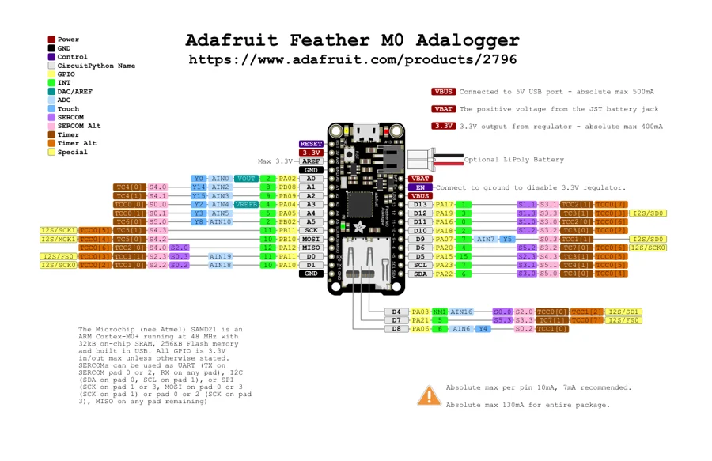

# Feather M0 Adalogger

**Adafruit** · SAMD21

Revision: Not identified

Coverage: Physical pinout source collected; scope and revision require confirmation

[Browse all manufacturers](../../../../BROWSE.md) · [Devices & IoT](../../../../DEVICES.md) · [Open in the browser guide](https://valleytech-black-wire-guide.pages.dev/?board=adafruit-feather-m0-adalogger)

Architecture: **ARM**

## Specifications and hardware documentation

- [Specifications & hardware guide](https://www.adafruit.com/product/2796)

## Original manufacturer graphical reference (PDF)

**original reference PDF** · Reviewed source · PDF

[Open original reference](../../../../library/media/e482f797990c0cc1cbd150fc478bb58c642737728fe716942df3641148cc8d6d.pdf)

**Credit and rights:** Adafruit / original diagram contributors. Rights not established for this asset; attribution retained. Original artwork is not covered by Black Wire's editorial license.. Source/manufacturer: Adafruit.

[Source 1](https://raw.githubusercontent.com/adafruit/Adafruit-Feather-M0-Adalogger-PCB/0147a7204c11ae57fc42c5424d5c700bcca875b2/Adafruit%20Feather%20M0%20Adalogger%20Pinout.pdf) · [Source 2](https://www.adafruit.com/product/2796) · [Source 3](https://github.com/adafruit/Adafruit-Feather-M0-Adalogger-PCB/tree/0147a7204c11ae57fc42c5424d5c700bcca875b2)

Original publisher reference. Exact board/revision and electrical limits still require confirmation.

Image revision: Not identified

SHA-256: `e482f797990c0cc1cbd150fc478bb58c642737728fe716942df3641148cc8d6d`

## Manufacturer board pinout — page 1

**pinout image** · Reviewed source · PNG

[Open original reference](../../../../library/media/c10f4b3660eccf06e169a6ceb5538313bc570e26114c29460519a78da5911c7c.png)

**Credit and rights:** Adafruit / original diagram contributors. Rights not established for this asset; attribution retained. Original artwork is not covered by Black Wire's editorial license.. Source/manufacturer: Adafruit.

[Source 1](https://raw.githubusercontent.com/adafruit/Adafruit-Feather-M0-Adalogger-PCB/0147a7204c11ae57fc42c5424d5c700bcca875b2/Adafruit%20Feather%20M0%20Adalogger%20Pinout.pdf) · [Source 2](https://www.adafruit.com/product/2796) · [Source 3](https://github.com/adafruit/Adafruit-Feather-M0-Adalogger-PCB/tree/0147a7204c11ae57fc42c5424d5c700bcca875b2)

Original publisher reference. Exact board/revision and electrical limits still require confirmation.  PDF page rendered at 144 dpi without changing labels. Original vector PDF retained.

Image revision: Not identified

SHA-256: `c10f4b3660eccf06e169a6ceb5538313bc570e26114c29460519a78da5911c7c`

Pin assignments have not been independently electrically verified. Check board revision before wiring.
