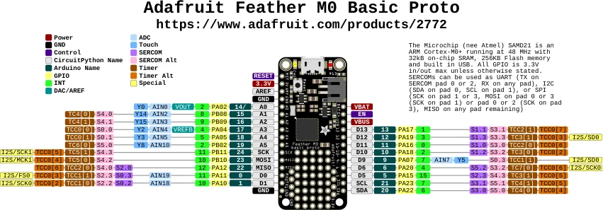

# Feather M0 Basic Proto

**Adafruit** · SAMD21

Revision: Not identified

Coverage: Physical pinout source collected; scope and revision require confirmation

[Browse all manufacturers](../../../../BROWSE.md) · [Devices & IoT](../../../../DEVICES.md) · [Open in the browser guide](https://valleytech-black-wire-guide.pages.dev/?board=adafruit-feather-m0-basic-proto)

Architecture: **ARM**

## Specifications and hardware documentation

- [Specifications & hardware guide](https://www.adafruit.com/product/2772)

## Original manufacturer graphical reference (PDF)

**original reference PDF** · Reviewed source · PDF

[Open original reference](../../../../library/media/301a71b4d5511722fef23f1c27250062af756458f7405d13fc3d997d4c50f19d.pdf)

**Credit and rights:** Adafruit / original diagram contributors. Rights not established for this asset; attribution retained. Original artwork is not covered by Black Wire's editorial license.. Source/manufacturer: Adafruit.

[Source 1](https://raw.githubusercontent.com/adafruit/Adafruit-Feather-M0-Basic-Proto-PCB/1de541ff46165575234d826ae64be64a82e8bc93/Adafruit%20Feather%20M0%20Basic%20Proto%20Pinout.pdf) · [Source 2](https://www.adafruit.com/product/2772) · [Source 3](https://github.com/adafruit/Adafruit-Feather-M0-Basic-Proto-PCB/tree/1de541ff46165575234d826ae64be64a82e8bc93)

Original publisher reference. Exact board/revision and electrical limits still require confirmation.

Image revision: Not identified

SHA-256: `301a71b4d5511722fef23f1c27250062af756458f7405d13fc3d997d4c50f19d`

## Manufacturer board pinout — page 1

**pinout image** · Reviewed source · PNG

[Open original reference](../../../../library/media/cec91a8eda3f085e48638fd6bec743624c87dc96060ae8795fd59e9755213977.png)

**Credit and rights:** Adafruit / original diagram contributors. Rights not established for this asset; attribution retained. Original artwork is not covered by Black Wire's editorial license.. Source/manufacturer: Adafruit.

[Source 1](https://raw.githubusercontent.com/adafruit/Adafruit-Feather-M0-Basic-Proto-PCB/1de541ff46165575234d826ae64be64a82e8bc93/Adafruit%20Feather%20M0%20Basic%20Proto%20Pinout.pdf) · [Source 2](https://www.adafruit.com/product/2772) · [Source 3](https://github.com/adafruit/Adafruit-Feather-M0-Basic-Proto-PCB/tree/1de541ff46165575234d826ae64be64a82e8bc93)

Original publisher reference. Exact board/revision and electrical limits still require confirmation.  PDF page rendered at 144 dpi without changing labels. Original vector PDF retained.

Image revision: Not identified

SHA-256: `cec91a8eda3f085e48638fd6bec743624c87dc96060ae8795fd59e9755213977`

Pin assignments have not been independently electrically verified. Check board revision before wiring.
