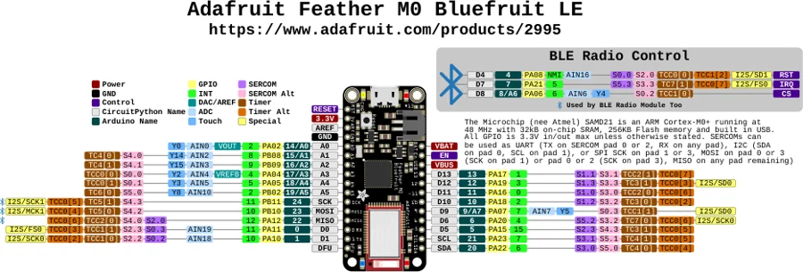

# Feather M0 Bluefruit LE

**Adafruit** · SAMD21

Revision: Not identified

Coverage: Physical pinout source collected; scope and revision require confirmation

[Browse all manufacturers](../../../../BROWSE.md) · [Devices & IoT](../../../../DEVICES.md) · [Open in the browser guide](https://valleytech-black-wire-guide.pages.dev/?board=adafruit-feather-m0-bluefruit-le)

Architecture: **ARM**

## Specifications and hardware documentation

- [Specifications & hardware guide](https://www.adafruit.com/product/2995)

## Original manufacturer graphical reference (PDF)

**original reference PDF** · Reviewed source · PDF

[Open original reference](../../../../library/media/51cb5541df9ea4ebf0596f20a50ce9baf3c2fa608cf3e269b53635c989399b79.pdf)

**Credit and rights:** Adafruit / original diagram contributors. Rights not established for this asset; attribution retained. Original artwork is not covered by Black Wire's editorial license.. Source/manufacturer: Adafruit.

[Source 1](https://raw.githubusercontent.com/adafruit/Adafruit-Feather-M0-Bluefruit-LE-PCB/b2e0b3f2930568da3471d6c42cb4919d573d3481/Adafruit%20Feather%20Zero%20BLE%20Pinout.pdf) · [Source 2](https://www.adafruit.com/product/2995) · [Source 3](https://github.com/adafruit/Adafruit-Feather-M0-Bluefruit-LE-PCB/tree/b2e0b3f2930568da3471d6c42cb4919d573d3481)

Original publisher reference. Exact board/revision and electrical limits still require confirmation.

Image revision: Not identified

SHA-256: `51cb5541df9ea4ebf0596f20a50ce9baf3c2fa608cf3e269b53635c989399b79`

## Manufacturer board pinout — page 1

**pinout image** · Reviewed source · PNG

[Open original reference](../../../../library/media/34fb8553b01a5e68f28c514cce42af33db330ecdf169fa8a2967c6c2ae6a0f48.png)

**Credit and rights:** Adafruit / original diagram contributors. Rights not established for this asset; attribution retained. Original artwork is not covered by Black Wire's editorial license.. Source/manufacturer: Adafruit.

[Source 1](https://raw.githubusercontent.com/adafruit/Adafruit-Feather-M0-Bluefruit-LE-PCB/b2e0b3f2930568da3471d6c42cb4919d573d3481/Adafruit%20Feather%20Zero%20BLE%20Pinout.pdf) · [Source 2](https://www.adafruit.com/product/2995) · [Source 3](https://github.com/adafruit/Adafruit-Feather-M0-Bluefruit-LE-PCB/tree/b2e0b3f2930568da3471d6c42cb4919d573d3481)

Original publisher reference. Exact board/revision and electrical limits still require confirmation.  PDF page rendered at 144 dpi without changing labels. Original vector PDF retained.

Image revision: Not identified

SHA-256: `34fb8553b01a5e68f28c514cce42af33db330ecdf169fa8a2967c6c2ae6a0f48`

Pin assignments have not been independently electrically verified. Check board revision before wiring.
