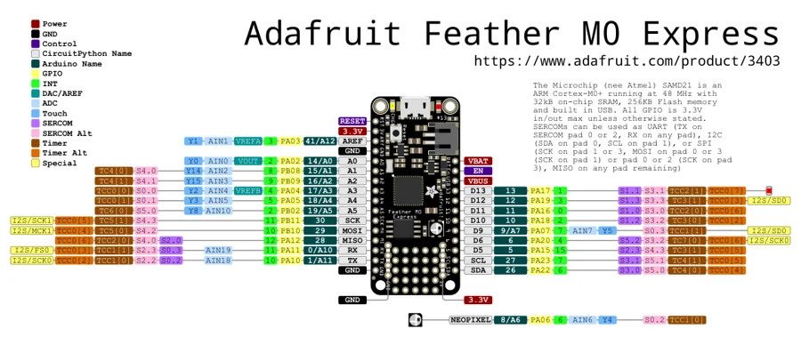

# Feather M0 Express

**Adafruit** · SAMD21

Revision: Not identified

Coverage: Physical pinout source collected; scope and revision require confirmation

[Browse all manufacturers](../../../../BROWSE.md) · [Devices & IoT](../../../../DEVICES.md) · [Open in the browser guide](https://valleytech-black-wire-guide.pages.dev/?board=adafruit-feather-m0-express)

Architecture: **ARM**

## Specifications and hardware documentation

- [Specifications & hardware guide](https://www.adafruit.com/product/3403)

## Original manufacturer graphical reference (PDF)

**original reference PDF** · Reviewed source · PDF

[Open original reference](../../../../library/media/c4b472f87994431e5471fa93be4c2cf8826c8349cd98c8553a173f309e2c9fd2.pdf)

**Credit and rights:** Adafruit / original diagram contributors. Rights not established for this asset; attribution retained. Original artwork is not covered by Black Wire's editorial license.. Source/manufacturer: Adafruit.

[Source 1](https://raw.githubusercontent.com/adafruit/Adafruit-Feather-M0-Express-PCB/5017ef41885371f8a26ba1b8ab9dd700bd7ce655/Adafruit%20Feather%20M0%20Express%20pinout.pdf) · [Source 2](https://www.adafruit.com/product/3403) · [Source 3](https://github.com/adafruit/Adafruit-Feather-M0-Express-PCB/tree/5017ef41885371f8a26ba1b8ab9dd700bd7ce655)

Original publisher reference. Exact board/revision and electrical limits still require confirmation.

Image revision: Not identified

SHA-256: `c4b472f87994431e5471fa93be4c2cf8826c8349cd98c8553a173f309e2c9fd2`

## Manufacturer board pinout — page 1

**pinout image** · Reviewed source · PNG

[Open original reference](../../../../library/media/45eba41c6b0d338da2bf5f2c56677320ad2e8c6f8d9da520d984c04ce4dfcf44.png)

**Credit and rights:** Adafruit / original diagram contributors. Rights not established for this asset; attribution retained. Original artwork is not covered by Black Wire's editorial license.. Source/manufacturer: Adafruit.

[Source 1](https://raw.githubusercontent.com/adafruit/Adafruit-Feather-M0-Express-PCB/5017ef41885371f8a26ba1b8ab9dd700bd7ce655/Adafruit%20Feather%20M0%20Express%20pinout.pdf) · [Source 2](https://www.adafruit.com/product/3403) · [Source 3](https://github.com/adafruit/Adafruit-Feather-M0-Express-PCB/tree/5017ef41885371f8a26ba1b8ab9dd700bd7ce655)

Original publisher reference. Exact board/revision and electrical limits still require confirmation.  PDF page rendered at 144 dpi without changing labels. Original vector PDF retained.

Image revision: Not identified

SHA-256: `45eba41c6b0d338da2bf5f2c56677320ad2e8c6f8d9da520d984c04ce4dfcf44`

Pin assignments have not been independently electrically verified. Check board revision before wiring.
