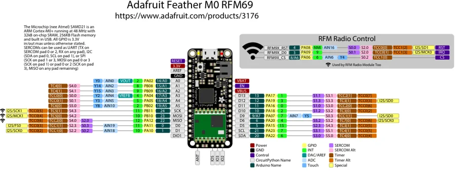

# Feather M0 RFM69

**Adafruit** · SAMD21

Revision: Not identified

Coverage: Physical pinout source collected; scope and revision require confirmation

[Browse all manufacturers](../../../../BROWSE.md) · [Devices & IoT](../../../../DEVICES.md) · [Open in the browser guide](https://valleytech-black-wire-guide.pages.dev/?board=adafruit-feather-m0-rfm69)

Architecture: **ARM**

## Specifications and hardware documentation

- [Specifications & hardware guide](https://www.adafruit.com/product/3176)

## Original manufacturer graphical reference (PDF)

**original reference PDF** · Reviewed source · PDF

[Open original reference](../../../../library/media/7b8ef7e0134a800b6c0fad069e63259dfdd7fa42c6dafc96b98e9955fc1d0bee.pdf)

**Credit and rights:** Adafruit / original diagram contributors. Rights not established for this asset; attribution retained. Original artwork is not covered by Black Wire's editorial license.. Source/manufacturer: Adafruit.

[Source 1](https://raw.githubusercontent.com/adafruit/Adafruit-Feather-M0-RFM-LoRa-PCB/1b3616c9daf1cd0643bb7f6a98f4e3c71fe16c83/Adafruit%20Feather%20M0%20RFM69%20Pinout.pdf) · [Source 2](https://www.adafruit.com/product/3176) · [Source 3](https://github.com/adafruit/Adafruit-Feather-M0-RFM-LoRa-PCB/tree/1b3616c9daf1cd0643bb7f6a98f4e3c71fe16c83)

Original publisher reference. Exact board/revision and electrical limits still require confirmation.

Image revision: Not identified

SHA-256: `7b8ef7e0134a800b6c0fad069e63259dfdd7fa42c6dafc96b98e9955fc1d0bee`

## Manufacturer board pinout — page 1

**pinout image** · Reviewed source · PNG

[Open original reference](../../../../library/media/aecdb69e63168a7e33971debe07b767e8d49319337a2e204ec5cf00f2aed725b.png)

**Credit and rights:** Adafruit / original diagram contributors. Rights not established for this asset; attribution retained. Original artwork is not covered by Black Wire's editorial license.. Source/manufacturer: Adafruit.

[Source 1](https://raw.githubusercontent.com/adafruit/Adafruit-Feather-M0-RFM-LoRa-PCB/1b3616c9daf1cd0643bb7f6a98f4e3c71fe16c83/Adafruit%20Feather%20M0%20RFM69%20Pinout.pdf) · [Source 2](https://www.adafruit.com/product/3176) · [Source 3](https://github.com/adafruit/Adafruit-Feather-M0-RFM-LoRa-PCB/tree/1b3616c9daf1cd0643bb7f6a98f4e3c71fe16c83)

Original publisher reference. Exact board/revision and electrical limits still require confirmation.  PDF page rendered at 144 dpi without changing labels. Original vector PDF retained.

Image revision: Not identified

SHA-256: `aecdb69e63168a7e33971debe07b767e8d49319337a2e204ec5cf00f2aed725b`

Pin assignments have not been independently electrically verified. Check board revision before wiring.
