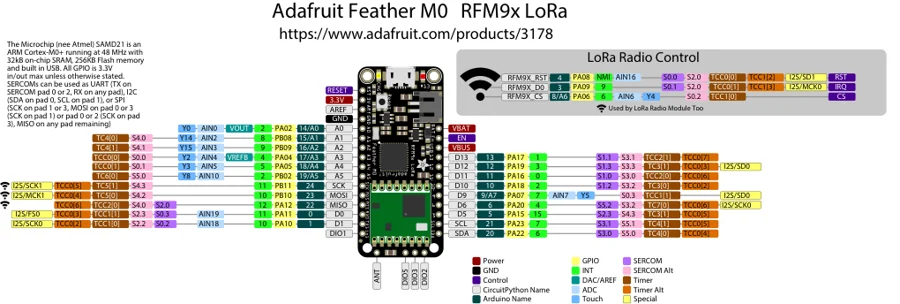

# Feather M0 RFM9x

**Adafruit** · SAMD21

Revision: Not identified

Coverage: Physical pinout source collected; scope and revision require confirmation

[Browse all manufacturers](../../../../BROWSE.md) · [Devices & IoT](../../../../DEVICES.md) · [Open in the browser guide](https://valleytech-black-wire-guide.pages.dev/?board=adafruit-feather-m0-rfm9x)

Architecture: **ARM**

## Specifications and hardware documentation

- [Specifications & hardware guide](https://www.adafruit.com/product/3178)

## Original manufacturer graphical reference (PDF)

**original reference PDF** · Reviewed source · PDF

[Open original reference](../../../../library/media/1a07538dbd16af7f6929cff9e79915ad07218254cd53ce5a2f03c3009bd2a1c4.pdf)

**Credit and rights:** Adafruit / original diagram contributors. Rights not established for this asset; attribution retained. Original artwork is not covered by Black Wire's editorial license.. Source/manufacturer: Adafruit.

[Source 1](https://raw.githubusercontent.com/adafruit/Adafruit-Feather-M0-RFM-LoRa-PCB/1b3616c9daf1cd0643bb7f6a98f4e3c71fe16c83/Adafruit%20Feather%20M0%20RFM9x%20Pinout.pdf) · [Source 2](https://www.adafruit.com/product/3178) · [Source 3](https://github.com/adafruit/Adafruit-Feather-M0-RFM-LoRa-PCB/tree/1b3616c9daf1cd0643bb7f6a98f4e3c71fe16c83)

Original publisher reference. Exact board/revision and electrical limits still require confirmation.

Image revision: Not identified

SHA-256: `1a07538dbd16af7f6929cff9e79915ad07218254cd53ce5a2f03c3009bd2a1c4`

## Manufacturer board pinout — page 1

**pinout image** · Reviewed source · PNG

[Open original reference](../../../../library/media/1180f30dc76b0cb8998eeaa5acff007f9f020469e6105745411f9f82aef886ce.png)

**Credit and rights:** Adafruit / original diagram contributors. Rights not established for this asset; attribution retained. Original artwork is not covered by Black Wire's editorial license.. Source/manufacturer: Adafruit.

[Source 1](https://raw.githubusercontent.com/adafruit/Adafruit-Feather-M0-RFM-LoRa-PCB/1b3616c9daf1cd0643bb7f6a98f4e3c71fe16c83/Adafruit%20Feather%20M0%20RFM9x%20Pinout.pdf) · [Source 2](https://www.adafruit.com/product/3178) · [Source 3](https://github.com/adafruit/Adafruit-Feather-M0-RFM-LoRa-PCB/tree/1b3616c9daf1cd0643bb7f6a98f4e3c71fe16c83)

Original publisher reference. Exact board/revision and electrical limits still require confirmation.  PDF page rendered at 144 dpi without changing labels. Original vector PDF retained.

Image revision: Not identified

SHA-256: `1180f30dc76b0cb8998eeaa5acff007f9f020469e6105745411f9f82aef886ce`

Pin assignments have not been independently electrically verified. Check board revision before wiring.
