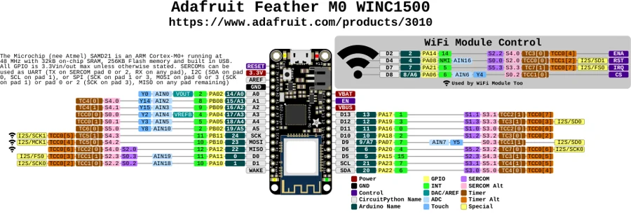

# Feather M0 WINC1500

**Adafruit** · SAMD21

Revision: Not identified

Coverage: Physical pinout source collected; scope and revision require confirmation

[Browse all manufacturers](../../../../BROWSE.md) · [Devices & IoT](../../../../DEVICES.md) · [Open in the browser guide](https://valleytech-black-wire-guide.pages.dev/?board=adafruit-feather-m0-winc1500)

Architecture: **ARM**

## Specifications and hardware documentation

- [Specifications & hardware guide](https://www.adafruit.com/product/3010)

## Original manufacturer graphical reference (PDF)

**original reference PDF** · Reviewed source · PDF

[Open original reference](../../../../library/media/d62e4eb934524902e675cd45f4505b2e5b0d5f982a03615681b326017ce2b72a.pdf)

**Credit and rights:** Adafruit / original diagram contributors. Rights not established for this asset; attribution retained. Original artwork is not covered by Black Wire's editorial license.. Source/manufacturer: Adafruit.

[Source 1](https://raw.githubusercontent.com/adafruit/Adafruit-Feather-M0-WiFi-WINC1500-PCB/20e781d8d7d0b31002f9d2a8eaef18429f983815/Adafruit%20Feather%20M0%20WINC1500%20Pinout.pdf) · [Source 2](https://www.adafruit.com/product/3010) · [Source 3](https://github.com/adafruit/Adafruit-Feather-M0-WiFi-WINC1500-PCB/tree/20e781d8d7d0b31002f9d2a8eaef18429f983815)

Original publisher reference. Exact board/revision and electrical limits still require confirmation.

Image revision: Not identified

SHA-256: `d62e4eb934524902e675cd45f4505b2e5b0d5f982a03615681b326017ce2b72a`

## Manufacturer board pinout — page 1

**pinout image** · Reviewed source · PNG

[Open original reference](../../../../library/media/bb7039405dd186a741d98551fb6e21c4804272277b8585e130ab39f77c610f98.png)

**Credit and rights:** Adafruit / original diagram contributors. Rights not established for this asset; attribution retained. Original artwork is not covered by Black Wire's editorial license.. Source/manufacturer: Adafruit.

[Source 1](https://raw.githubusercontent.com/adafruit/Adafruit-Feather-M0-WiFi-WINC1500-PCB/20e781d8d7d0b31002f9d2a8eaef18429f983815/Adafruit%20Feather%20M0%20WINC1500%20Pinout.pdf) · [Source 2](https://www.adafruit.com/product/3010) · [Source 3](https://github.com/adafruit/Adafruit-Feather-M0-WiFi-WINC1500-PCB/tree/20e781d8d7d0b31002f9d2a8eaef18429f983815)

Original publisher reference. Exact board/revision and electrical limits still require confirmation.  PDF page rendered at 144 dpi without changing labels. Original vector PDF retained.

Image revision: Not identified

SHA-256: `bb7039405dd186a741d98551fb6e21c4804272277b8585e130ab39f77c610f98`

Pin assignments have not been independently electrically verified. Check board revision before wiring.
