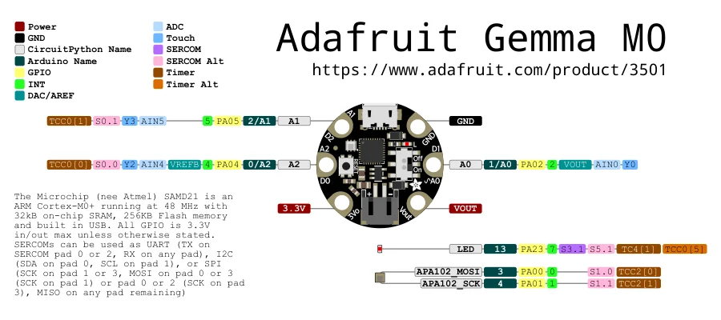

# GEMMA M0

**Adafruit** · SAMD21

Revision: Not identified

Coverage: Physical pinout source collected; scope and revision require confirmation

[Browse all manufacturers](../../../../BROWSE.md) · [Devices & IoT](../../../../DEVICES.md) · [Open in the browser guide](https://valleytech-black-wire-guide.pages.dev/?board=adafruit-gemma-m0)

Architecture: **ARM**

## Specifications and hardware documentation

- [Specifications & hardware guide](https://www.adafruit.com/product/3501)

## Original manufacturer graphical reference (PDF)

**original reference PDF** · Reviewed source · PDF

[Open original reference](../../../../library/media/bf42eb73f0f748ea2ff7c03491353f5ede0907d6c381a48f148e5d58babc5868.pdf)

**Credit and rights:** Adafruit / original diagram contributors. Rights not established for this asset; attribution retained. Original artwork is not covered by Black Wire's editorial license.. Source/manufacturer: Adafruit.

[Source 1](https://raw.githubusercontent.com/adafruit/Adafruit-Gemma-M0-PCB/682dbf68e51ad478915fdf6520119f15588f4375/Adafruit%20GEMMA%20M0%20pinout.pdf) · [Source 2](https://www.adafruit.com/product/3501) · [Source 3](https://github.com/adafruit/Adafruit-Gemma-M0-PCB/tree/682dbf68e51ad478915fdf6520119f15588f4375)

Original publisher reference. Exact board/revision and electrical limits still require confirmation.

Image revision: Not identified

SHA-256: `bf42eb73f0f748ea2ff7c03491353f5ede0907d6c381a48f148e5d58babc5868`

## Manufacturer board pinout — page 1

**pinout image** · Reviewed source · PNG

[Open original reference](../../../../library/media/1ffafbfa4ef171dd92ca17aeb14a5e15a3f9496c7e55b2b594223e9581f30dfb.png)

**Credit and rights:** Adafruit / original diagram contributors. Rights not established for this asset; attribution retained. Original artwork is not covered by Black Wire's editorial license.. Source/manufacturer: Adafruit.

[Source 1](https://raw.githubusercontent.com/adafruit/Adafruit-Gemma-M0-PCB/682dbf68e51ad478915fdf6520119f15588f4375/Adafruit%20GEMMA%20M0%20pinout.pdf) · [Source 2](https://www.adafruit.com/product/3501) · [Source 3](https://github.com/adafruit/Adafruit-Gemma-M0-PCB/tree/682dbf68e51ad478915fdf6520119f15588f4375)

Original publisher reference. Exact board/revision and electrical limits still require confirmation.  PDF page rendered at 144 dpi without changing labels. Original vector PDF retained.

Image revision: Not identified

SHA-256: `1ffafbfa4ef171dd92ca17aeb14a5e15a3f9496c7e55b2b594223e9581f30dfb`

Pin assignments have not been independently electrically verified. Check board revision before wiring.
