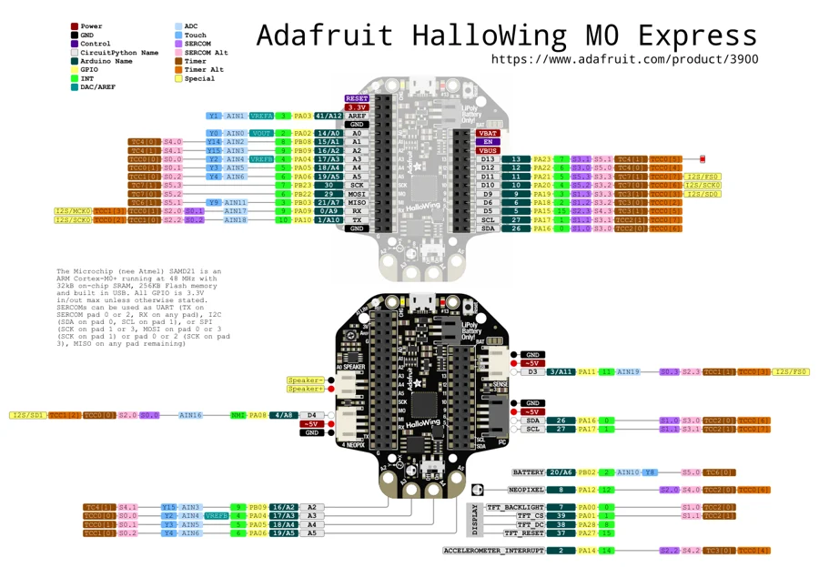

# HalloWing M0

**Adafruit** · SAMD21

Revision: Not identified

Coverage: Physical pinout source collected; scope and revision require confirmation

[Browse all manufacturers](../../../../BROWSE.md) · [Devices & IoT](../../../../DEVICES.md) · [Open in the browser guide](https://valleytech-black-wire-guide.pages.dev/?board=adafruit-hallowing-m0)

Architecture: **ARM**

## Specifications and hardware documentation

- [Specifications & hardware guide](https://www.adafruit.com/product/3900)

## Original manufacturer graphical reference (PDF)

**original reference PDF** · Reviewed source · PDF

[Open original reference](../../../../library/media/217399878cb644d53fcf59104d354d0c3dbbed831d3520970483c85b742c8822.pdf)

**Credit and rights:** Adafruit / original diagram contributors. Rights not established for this asset; attribution retained. Original artwork is not covered by Black Wire's editorial license.. Source/manufacturer: Adafruit.

[Source 1](https://raw.githubusercontent.com/adafruit/Adafruit-Hallowing-M0-PCB/c0585b0672ce13e163b8da6ce9215ec600c63d64/Adafruit%20HalloWing%20M0%20pinout.pdf) · [Source 2](https://www.adafruit.com/product/3900) · [Source 3](https://github.com/adafruit/Adafruit-Hallowing-M0-PCB/tree/c0585b0672ce13e163b8da6ce9215ec600c63d64)

Original publisher reference. Exact board/revision and electrical limits still require confirmation.

Image revision: Not identified

SHA-256: `217399878cb644d53fcf59104d354d0c3dbbed831d3520970483c85b742c8822`

## Manufacturer board pinout — page 1

**pinout image** · Reviewed source · PNG

[Open original reference](../../../../library/media/8d7d439c32becd4aa81d6439ba2c99a8737504e4d589e054c52640a685440f80.png)

**Credit and rights:** Adafruit / original diagram contributors. Rights not established for this asset; attribution retained. Original artwork is not covered by Black Wire's editorial license.. Source/manufacturer: Adafruit.

[Source 1](https://raw.githubusercontent.com/adafruit/Adafruit-Hallowing-M0-PCB/c0585b0672ce13e163b8da6ce9215ec600c63d64/Adafruit%20HalloWing%20M0%20pinout.pdf) · [Source 2](https://www.adafruit.com/product/3900) · [Source 3](https://github.com/adafruit/Adafruit-Hallowing-M0-PCB/tree/c0585b0672ce13e163b8da6ce9215ec600c63d64)

Original publisher reference. Exact board/revision and electrical limits still require confirmation.  PDF page rendered at 144 dpi without changing labels. Original vector PDF retained.

Image revision: Not identified

SHA-256: `8d7d439c32becd4aa81d6439ba2c99a8737504e4d589e054c52640a685440f80`

Pin assignments have not been independently electrically verified. Check board revision before wiring.
