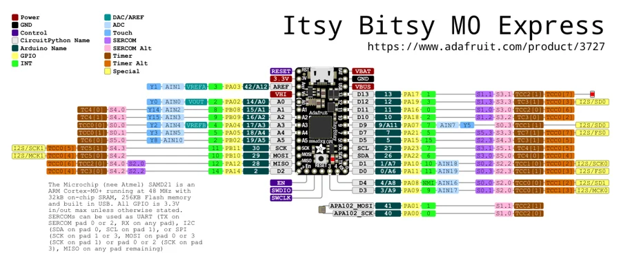

# ItsyBitsy M0

**Adafruit** · SAMD21

Revision: Not identified

Coverage: Physical pinout source collected; scope and revision require confirmation

[Browse all manufacturers](../../../../BROWSE.md) · [Devices & IoT](../../../../DEVICES.md) · [Open in the browser guide](https://valleytech-black-wire-guide.pages.dev/?board=adafruit-itsybitsy-m0)

Architecture: **ARM**

## Specifications and hardware documentation

- [Specifications & hardware guide](https://www.adafruit.com/product/3727)

## Original manufacturer graphical reference (PDF)

**original reference PDF** · Reviewed source · PDF

[Open original reference](../../../../library/media/f0c7afecfe9cb4d6e584f7f0dd5ad5efe96d6be9c1dc4db5023fd13a5e4f7a9c.pdf)

**Credit and rights:** Adafruit / original diagram contributors. Rights not established for this asset; attribution retained. Original artwork is not covered by Black Wire's editorial license.. Source/manufacturer: Adafruit.

[Source 1](https://raw.githubusercontent.com/adafruit/Adafruit-ItsyBitsy-M0-PCB/faa92dda428868c7042f9ee04685ffdc70849725/Adafruit%20ItsyBitsy%20M0%20pinout.pdf) · [Source 2](https://www.adafruit.com/product/3727) · [Source 3](https://github.com/adafruit/Adafruit-ItsyBitsy-M0-PCB/tree/faa92dda428868c7042f9ee04685ffdc70849725)

Original publisher reference. Exact board/revision and electrical limits still require confirmation.

Image revision: Not identified

SHA-256: `f0c7afecfe9cb4d6e584f7f0dd5ad5efe96d6be9c1dc4db5023fd13a5e4f7a9c`

## Manufacturer board pinout — page 1

**pinout image** · Reviewed source · PNG

[Open original reference](../../../../library/media/7727e44edfc322c1ed16d82fc724432a2d73c6f6f1bac81d57b3254b028e5a10.png)

**Credit and rights:** Adafruit / original diagram contributors. Rights not established for this asset; attribution retained. Original artwork is not covered by Black Wire's editorial license.. Source/manufacturer: Adafruit.

[Source 1](https://raw.githubusercontent.com/adafruit/Adafruit-ItsyBitsy-M0-PCB/faa92dda428868c7042f9ee04685ffdc70849725/Adafruit%20ItsyBitsy%20M0%20pinout.pdf) · [Source 2](https://www.adafruit.com/product/3727) · [Source 3](https://github.com/adafruit/Adafruit-ItsyBitsy-M0-PCB/tree/faa92dda428868c7042f9ee04685ffdc70849725)

Original publisher reference. Exact board/revision and electrical limits still require confirmation.  PDF page rendered at 144 dpi without changing labels. Original vector PDF retained.

Image revision: Not identified

SHA-256: `7727e44edfc322c1ed16d82fc724432a2d73c6f6f1bac81d57b3254b028e5a10`

Pin assignments have not been independently electrically verified. Check board revision before wiring.
