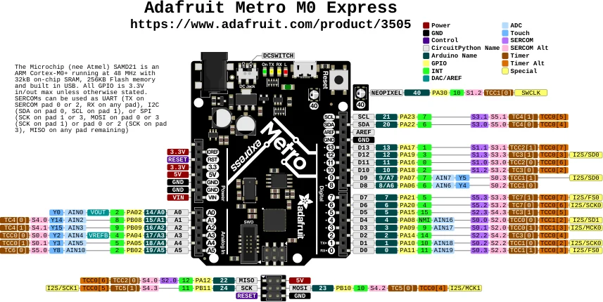

# Metro M0 Express

**Adafruit** · SAMD21

Revision: Not identified

Coverage: Physical pinout source collected; scope and revision require confirmation

[Browse all manufacturers](../../../../BROWSE.md) · [Devices & IoT](../../../../DEVICES.md) · [Open in the browser guide](https://valleytech-black-wire-guide.pages.dev/?board=adafruit-metro-m0-express)

Architecture: **ARM**

## Specifications and hardware documentation

- [Specifications & hardware guide](https://www.adafruit.com/product/3505)

## Original manufacturer graphical reference (PDF)

**original reference PDF** · Reviewed source · PDF

[Open original reference](../../../../library/media/e8916dea2cbb704909cd57cbd38410c44deb25ea29a265a7b5cdc172916f32d7.pdf)

**Credit and rights:** Adafruit / original diagram contributors. Rights not established for this asset; attribution retained. Original artwork is not covered by Black Wire's editorial license.. Source/manufacturer: Adafruit.

[Source 1](https://raw.githubusercontent.com/adafruit/Adafruit-Metro-M0-Express-PCB/6cdfd4d238f82ee87c0b3b3b91f90878fcc6a125/Adafruit%20Metro%20M0%20Express%20Pinout.pdf) · [Source 2](https://www.adafruit.com/product/3505) · [Source 3](https://github.com/adafruit/Adafruit-Metro-M0-Express-PCB/tree/6cdfd4d238f82ee87c0b3b3b91f90878fcc6a125)

Original publisher reference. Exact board/revision and electrical limits still require confirmation.

Image revision: Not identified

SHA-256: `e8916dea2cbb704909cd57cbd38410c44deb25ea29a265a7b5cdc172916f32d7`

## Manufacturer board pinout — page 1

**pinout image** · Reviewed source · PNG

[Open original reference](../../../../library/media/03ba645b4119f261529e13f90c1123186caf4b084d9c096bb6ce37c7153b57d5.png)

**Credit and rights:** Adafruit / original diagram contributors. Rights not established for this asset; attribution retained. Original artwork is not covered by Black Wire's editorial license.. Source/manufacturer: Adafruit.

[Source 1](https://raw.githubusercontent.com/adafruit/Adafruit-Metro-M0-Express-PCB/6cdfd4d238f82ee87c0b3b3b91f90878fcc6a125/Adafruit%20Metro%20M0%20Express%20Pinout.pdf) · [Source 2](https://www.adafruit.com/product/3505) · [Source 3](https://github.com/adafruit/Adafruit-Metro-M0-Express-PCB/tree/6cdfd4d238f82ee87c0b3b3b91f90878fcc6a125)

Original publisher reference. Exact board/revision and electrical limits still require confirmation.  PDF page rendered at 144 dpi without changing labels. Original vector PDF retained.

Image revision: Not identified

SHA-256: `03ba645b4119f261529e13f90c1123186caf4b084d9c096bb6ce37c7153b57d5`

Pin assignments have not been independently electrically verified. Check board revision before wiring.
