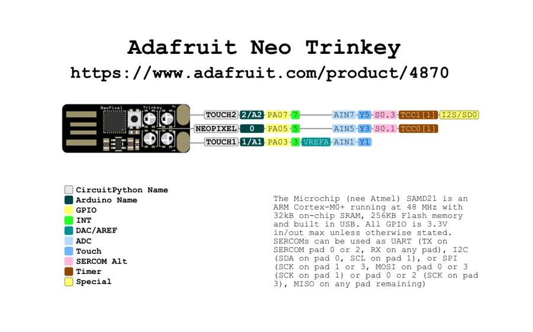

# Neo Trinkey

**Adafruit** · SAMD21

Revision: Not identified

Coverage: Physical pinout source collected; scope and revision require confirmation

[Browse all manufacturers](../../../../BROWSE.md) · [Devices & IoT](../../../../DEVICES.md) · [Open in the browser guide](https://valleytech-black-wire-guide.pages.dev/?board=adafruit-neo-trinkey)

Architecture: **ARM**

## Specifications and hardware documentation

- [Specifications & hardware guide](https://www.adafruit.com/product/4870)

## Original manufacturer graphical reference (PDF)

**original reference PDF** · Reviewed source · PDF

[Open original reference](../../../../library/media/0343ea39a6d62140eb0d11c2c7a393dc2700fb23d24d527ff5b744259eadc94a.pdf)

**Credit and rights:** Adafruit / original diagram contributors. Rights not established for this asset; attribution retained. Original artwork is not covered by Black Wire's editorial license.. Source/manufacturer: Adafruit.

[Source 1](https://raw.githubusercontent.com/adafruit/Adafruit-Neo-Trinkey-PCB/65c1e5f1d3c088cec327f7b2b0489bb7e085eed8/Adafruit%20Neo%20Trinkey%20Pinout.pdf) · [Source 2](https://www.adafruit.com/product/4870) · [Source 3](https://github.com/adafruit/Adafruit-Neo-Trinkey-PCB/tree/65c1e5f1d3c088cec327f7b2b0489bb7e085eed8)

Original publisher reference. Exact board/revision and electrical limits still require confirmation.

Image revision: Not identified

SHA-256: `0343ea39a6d62140eb0d11c2c7a393dc2700fb23d24d527ff5b744259eadc94a`

## Manufacturer board pinout — page 1

**pinout image** · Reviewed source · PNG

[Open original reference](../../../../library/media/c811a248545a8a953ea2f7acbd4a66319043b45089f5c76a4e34d6a63f9ccc5d.png)

**Credit and rights:** Adafruit / original diagram contributors. Rights not established for this asset; attribution retained. Original artwork is not covered by Black Wire's editorial license.. Source/manufacturer: Adafruit.

[Source 1](https://raw.githubusercontent.com/adafruit/Adafruit-Neo-Trinkey-PCB/65c1e5f1d3c088cec327f7b2b0489bb7e085eed8/Adafruit%20Neo%20Trinkey%20Pinout.pdf) · [Source 2](https://www.adafruit.com/product/4870) · [Source 3](https://github.com/adafruit/Adafruit-Neo-Trinkey-PCB/tree/65c1e5f1d3c088cec327f7b2b0489bb7e085eed8)

Original publisher reference. Exact board/revision and electrical limits still require confirmation.  PDF page rendered at 144 dpi without changing labels. Original vector PDF retained.

Image revision: Not identified

SHA-256: `c811a248545a8a953ea2f7acbd4a66319043b45089f5c76a4e34d6a63f9ccc5d`

Pin assignments have not been independently electrically verified. Check board revision before wiring.
