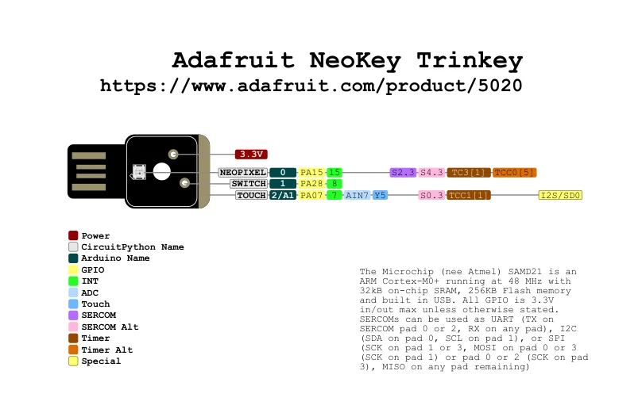

# NeoKey Trinkey

**Adafruit** · SAMD21

Revision: Not identified

Coverage: Physical pinout source collected; scope and revision require confirmation

[Browse all manufacturers](../../../../BROWSE.md) · [Devices & IoT](../../../../DEVICES.md) · [Open in the browser guide](https://valleytech-black-wire-guide.pages.dev/?board=adafruit-neokey-trinkey)

Architecture: **ARM**

## Specifications and hardware documentation

- [Specifications & hardware guide](https://www.adafruit.com/product/5020)

## Original manufacturer graphical reference (PDF)

**original reference PDF** · Reviewed source · PDF

[Open original reference](../../../../library/media/139f46a776e48f3713fe80df8a40a025f54c5317103448a3cd8081b943bf2ae2.pdf)

**Credit and rights:** Adafruit / original diagram contributors. Rights not established for this asset; attribution retained. Original artwork is not covered by Black Wire's editorial license.. Source/manufacturer: Adafruit.

[Source 1](https://raw.githubusercontent.com/adafruit/Adafruit-NeoKey-Trinkey-PCB/c6a77bea3980cbdd7b0163c4f5c0aa1f4dfe51e6/Adafruit%20NeoKey%20Trinkey%20Pinout.pdf) · [Source 2](https://www.adafruit.com/product/5020) · [Source 3](https://github.com/adafruit/Adafruit-NeoKey-Trinkey-PCB/tree/c6a77bea3980cbdd7b0163c4f5c0aa1f4dfe51e6)

Original publisher reference. Exact board/revision and electrical limits still require confirmation.

Image revision: Not identified

SHA-256: `139f46a776e48f3713fe80df8a40a025f54c5317103448a3cd8081b943bf2ae2`

## Manufacturer board pinout — page 1

**pinout image** · Reviewed source · PNG

[Open original reference](../../../../library/media/b4bb0f7625ec61125e898116ff5b5cf0d9655cae6b437d2f560d67ad7beb6d41.png)

**Credit and rights:** Adafruit / original diagram contributors. Rights not established for this asset; attribution retained. Original artwork is not covered by Black Wire's editorial license.. Source/manufacturer: Adafruit.

[Source 1](https://raw.githubusercontent.com/adafruit/Adafruit-NeoKey-Trinkey-PCB/c6a77bea3980cbdd7b0163c4f5c0aa1f4dfe51e6/Adafruit%20NeoKey%20Trinkey%20Pinout.pdf) · [Source 2](https://www.adafruit.com/product/5020) · [Source 3](https://github.com/adafruit/Adafruit-NeoKey-Trinkey-PCB/tree/c6a77bea3980cbdd7b0163c4f5c0aa1f4dfe51e6)

Original publisher reference. Exact board/revision and electrical limits still require confirmation.  PDF page rendered at 144 dpi without changing labels. Original vector PDF retained.

Image revision: Not identified

SHA-256: `b4bb0f7625ec61125e898116ff5b5cf0d9655cae6b437d2f560d67ad7beb6d41`

Pin assignments have not been independently electrically verified. Check board revision before wiring.
