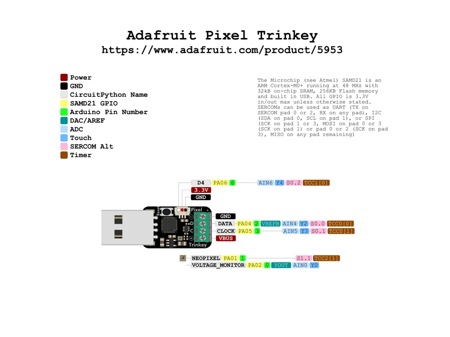

# Pixel Trinkey

**Adafruit** · SAMD21

Revision: Not identified

Coverage: Physical pinout source collected; scope and revision require confirmation

[Browse all manufacturers](../../../../BROWSE.md) · [Devices & IoT](../../../../DEVICES.md) · [Open in the browser guide](https://valleytech-black-wire-guide.pages.dev/?board=adafruit-pixel-trinkey)

Architecture: **ARM**

## Specifications and hardware documentation

- [Specifications & hardware guide](https://www.adafruit.com/product/5953)

## Original manufacturer graphical reference (PDF)

**original reference PDF** · Reviewed source · PDF

[Open original reference](../../../../library/media/f3965d8ca3a67135eac39031317aaa1aad42f8174e493a8068538b7be56df31d.pdf)

**Credit and rights:** Adafruit / original diagram contributors. Rights not established for this asset; attribution retained. Original artwork is not covered by Black Wire's editorial license.. Source/manufacturer: Adafruit.

[Source 1](https://raw.githubusercontent.com/adafruit/Adafruit-Pixel-Trinkey-PCB/3331f2f048f8ea2769698f96f35f18969f4f3619/Adafruit%20Pixel%20Trinkey%20PrettyPins.pdf) · [Source 2](https://www.adafruit.com/product/5953) · [Source 3](https://github.com/adafruit/Adafruit-Pixel-Trinkey-PCB/tree/3331f2f048f8ea2769698f96f35f18969f4f3619)

Original publisher reference. Exact board/revision and electrical limits still require confirmation.

Image revision: Not identified

SHA-256: `f3965d8ca3a67135eac39031317aaa1aad42f8174e493a8068538b7be56df31d`

## Manufacturer board pinout — page 1

**pinout image** · Reviewed source · PNG

[Open original reference](../../../../library/media/38af7b9e6b5b40ba57955d5688bcc6c24b6c98dc54fac0089560255a4ddbd094.png)

**Credit and rights:** Adafruit / original diagram contributors. Rights not established for this asset; attribution retained. Original artwork is not covered by Black Wire's editorial license.. Source/manufacturer: Adafruit.

[Source 1](https://raw.githubusercontent.com/adafruit/Adafruit-Pixel-Trinkey-PCB/3331f2f048f8ea2769698f96f35f18969f4f3619/Adafruit%20Pixel%20Trinkey%20PrettyPins.pdf) · [Source 2](https://www.adafruit.com/product/5953) · [Source 3](https://github.com/adafruit/Adafruit-Pixel-Trinkey-PCB/tree/3331f2f048f8ea2769698f96f35f18969f4f3619)

Original publisher reference. Exact board/revision and electrical limits still require confirmation.  PDF page rendered at 144 dpi without changing labels. Original vector PDF retained.

Image revision: Not identified

SHA-256: `38af7b9e6b5b40ba57955d5688bcc6c24b6c98dc54fac0089560255a4ddbd094`

Pin assignments have not been independently electrically verified. Check board revision before wiring.
