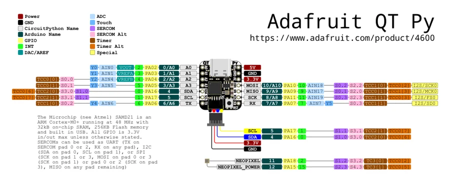

# QT Py SAMD21

**Adafruit** · SAMD21

Revision: Not identified

Coverage: Physical pinout source collected; scope and revision require confirmation

[Browse all manufacturers](../../../../BROWSE.md) · [Devices & IoT](../../../../DEVICES.md) · [Open in the browser guide](https://valleytech-black-wire-guide.pages.dev/?board=adafruit-qt-py-samd21)

Architecture: **ARM**

## Specifications and hardware documentation

- [Specifications & hardware guide](https://www.adafruit.com/product/4600)

## Original manufacturer graphical reference (PDF)

**original reference PDF** · Reviewed source · PDF

[Open original reference](../../../../library/media/ea10e6ebb99d672e9dc8947f0e272e09a9ef0a0f7aa36fb1f24bd2ef35b79e0d.pdf)

**Credit and rights:** Adafruit / original diagram contributors. Rights not established for this asset; attribution retained. Original artwork is not covered by Black Wire's editorial license.. Source/manufacturer: Adafruit.

[Source 1](https://raw.githubusercontent.com/adafruit/Adafruit-QT-Py-PCB/a8caed9ad5f2670c662f0b0a68af62cceb3cec96/Adafruit%20QT%20Py%20SAMD21%20pinout.pdf) · [Source 2](https://www.adafruit.com/product/4600) · [Source 3](https://github.com/adafruit/Adafruit-QT-Py-PCB/tree/a8caed9ad5f2670c662f0b0a68af62cceb3cec96)

Original publisher reference. Exact board/revision and electrical limits still require confirmation.

Image revision: Not identified

SHA-256: `ea10e6ebb99d672e9dc8947f0e272e09a9ef0a0f7aa36fb1f24bd2ef35b79e0d`

## Manufacturer board pinout — page 1

**pinout image** · Reviewed source · PNG

[Open original reference](../../../../library/media/8032f04e5a7218903e0692af9f5c4164b833aaf6e9908be03af3e987f7d28031.png)

**Credit and rights:** Adafruit / original diagram contributors. Rights not established for this asset; attribution retained. Original artwork is not covered by Black Wire's editorial license.. Source/manufacturer: Adafruit.

[Source 1](https://raw.githubusercontent.com/adafruit/Adafruit-QT-Py-PCB/a8caed9ad5f2670c662f0b0a68af62cceb3cec96/Adafruit%20QT%20Py%20SAMD21%20pinout.pdf) · [Source 2](https://www.adafruit.com/product/4600) · [Source 3](https://github.com/adafruit/Adafruit-QT-Py-PCB/tree/a8caed9ad5f2670c662f0b0a68af62cceb3cec96)

Original publisher reference. Exact board/revision and electrical limits still require confirmation.  PDF page rendered at 144 dpi without changing labels. Original vector PDF retained.

Image revision: Not identified

SHA-256: `8032f04e5a7218903e0692af9f5c4164b833aaf6e9908be03af3e987f7d28031`

Pin assignments have not been independently electrically verified. Check board revision before wiring.
