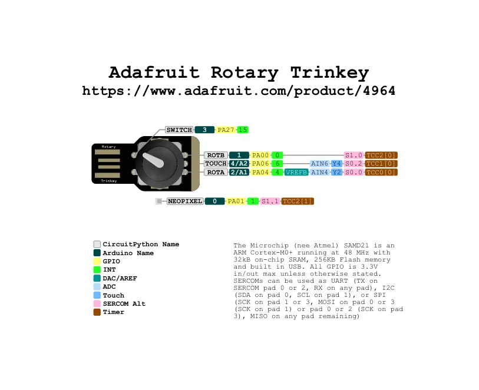

# Rotary Trinkey

**Adafruit** · SAMD21

Revision: Not identified

Coverage: Physical pinout source collected; scope and revision require confirmation

[Browse all manufacturers](../../../../BROWSE.md) · [Devices & IoT](../../../../DEVICES.md) · [Open in the browser guide](https://valleytech-black-wire-guide.pages.dev/?board=adafruit-rotary-trinkey)

Architecture: **ARM**

## Specifications and hardware documentation

- [Specifications & hardware guide](https://www.adafruit.com/product/4964)

## Original manufacturer graphical reference (PDF)

**original reference PDF** · Reviewed source · PDF

[Open original reference](../../../../library/media/a18380a500e11149fc189abafa6335c68dfc199a27edffb6669cc64262898296.pdf)

**Credit and rights:** Adafruit / original diagram contributors. Rights not established for this asset; attribution retained. Original artwork is not covered by Black Wire's editorial license.. Source/manufacturer: Adafruit.

[Source 1](https://raw.githubusercontent.com/adafruit/Adafruit-Rotary-Trinkey-PCB/b93b2aeaabbfbfd231eec6c88afc6694d4581410/Adafruit%20Rotary%20Trinkey%20Pinout.pdf) · [Source 2](https://www.adafruit.com/product/4964) · [Source 3](https://github.com/adafruit/Adafruit-Rotary-Trinkey-PCB/tree/b93b2aeaabbfbfd231eec6c88afc6694d4581410)

Original publisher reference. Exact board/revision and electrical limits still require confirmation.

Image revision: Not identified

SHA-256: `a18380a500e11149fc189abafa6335c68dfc199a27edffb6669cc64262898296`

## Manufacturer board pinout — page 1

**pinout image** · Reviewed source · PNG

[Open original reference](../../../../library/media/17ce093d02567cd81322f2e55a9cd1a908c59db506d6fd598b3013629b96e4c7.png)

**Credit and rights:** Adafruit / original diagram contributors. Rights not established for this asset; attribution retained. Original artwork is not covered by Black Wire's editorial license.. Source/manufacturer: Adafruit.

[Source 1](https://raw.githubusercontent.com/adafruit/Adafruit-Rotary-Trinkey-PCB/b93b2aeaabbfbfd231eec6c88afc6694d4581410/Adafruit%20Rotary%20Trinkey%20Pinout.pdf) · [Source 2](https://www.adafruit.com/product/4964) · [Source 3](https://github.com/adafruit/Adafruit-Rotary-Trinkey-PCB/tree/b93b2aeaabbfbfd231eec6c88afc6694d4581410)

Original publisher reference. Exact board/revision and electrical limits still require confirmation.  PDF page rendered at 144 dpi without changing labels. Original vector PDF retained.

Image revision: Not identified

SHA-256: `17ce093d02567cd81322f2e55a9cd1a908c59db506d6fd598b3013629b96e4c7`

Pin assignments have not been independently electrically verified. Check board revision before wiring.
