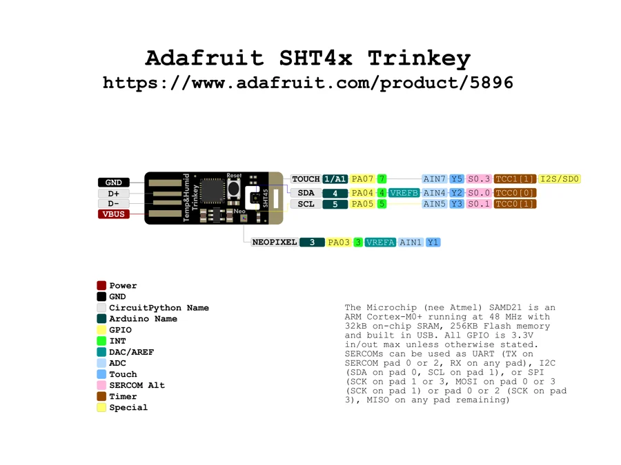

# SHT45 Trinkey

**Adafruit** · SAMD21

Revision: Not identified

Coverage: Physical pinout source collected; scope and revision require confirmation

[Browse all manufacturers](../../../../BROWSE.md) · [Devices & IoT](../../../../DEVICES.md) · [Open in the browser guide](https://valleytech-black-wire-guide.pages.dev/?board=adafruit-sht4x-trinkey)

Architecture: **ARM**

## Specifications and hardware documentation

- [Specifications & hardware guide](https://www.adafruit.com/product/5896)

## Original manufacturer graphical reference (PDF)

**original reference PDF** · Reviewed source · PDF

[Open original reference](../../../../library/media/fbba3c11b8f989c35592a7d7f8482a215eba454b448b7db203f7c142340780c1.pdf)

**Credit and rights:** Adafruit / original diagram contributors. Rights not established for this asset; attribution retained. Original artwork is not covered by Black Wire's editorial license.. Source/manufacturer: Adafruit.

[Source 1](https://raw.githubusercontent.com/adafruit/Adafruit-SHT4x-Trinkey-PCB/56dc3b26c14a202ee8db53184b9ac5c2ba787e03/Adafruit%20SHT4x%20Trinkey%20PrettyPins.pdf) · [Source 2](https://www.adafruit.com/product/5896) · [Source 3](https://github.com/adafruit/Adafruit-SHT4x-Trinkey-PCB/tree/56dc3b26c14a202ee8db53184b9ac5c2ba787e03)

Original publisher reference. Exact board/revision and electrical limits still require confirmation.

Image revision: Not identified

SHA-256: `fbba3c11b8f989c35592a7d7f8482a215eba454b448b7db203f7c142340780c1`

## Manufacturer board pinout — page 1

**pinout image** · Reviewed source · PNG

[Open original reference](../../../../library/media/d230d08c1a06ca227bd0bc57c6ed592b88284ff42a9aa7ed8013433f1ac2c23b.png)

**Credit and rights:** Adafruit / original diagram contributors. Rights not established for this asset; attribution retained. Original artwork is not covered by Black Wire's editorial license.. Source/manufacturer: Adafruit.

[Source 1](https://raw.githubusercontent.com/adafruit/Adafruit-SHT4x-Trinkey-PCB/56dc3b26c14a202ee8db53184b9ac5c2ba787e03/Adafruit%20SHT4x%20Trinkey%20PrettyPins.pdf) · [Source 2](https://www.adafruit.com/product/5896) · [Source 3](https://github.com/adafruit/Adafruit-SHT4x-Trinkey-PCB/tree/56dc3b26c14a202ee8db53184b9ac5c2ba787e03)

Original publisher reference. Exact board/revision and electrical limits still require confirmation.  PDF page rendered at 144 dpi without changing labels. Original vector PDF retained.

Image revision: Not identified

SHA-256: `d230d08c1a06ca227bd0bc57c6ed592b88284ff42a9aa7ed8013433f1ac2c23b`

Pin assignments have not been independently electrically verified. Check board revision before wiring.
