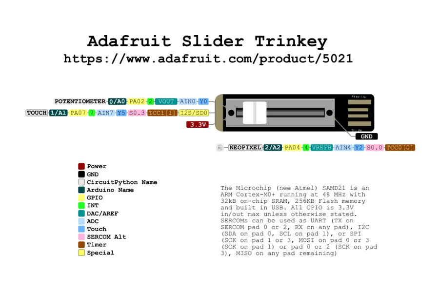

# Slider Trinkey

**Adafruit** · SAMD21

Revision: Not identified

Coverage: Physical pinout source collected; scope and revision require confirmation

[Browse all manufacturers](../../../../BROWSE.md) · [Devices & IoT](../../../../DEVICES.md) · [Open in the browser guide](https://valleytech-black-wire-guide.pages.dev/?board=adafruit-slider-trinkey)

Architecture: **ARM**

## Specifications and hardware documentation

- [Specifications & hardware guide](https://www.adafruit.com/product/5021)

## Original manufacturer graphical reference (PDF)

**original reference PDF** · Reviewed source · PDF

[Open original reference](../../../../library/media/1f66161ad6b7e0fc29479566259b3606f497c215343c5e0a326eb942279badc9.pdf)

**Credit and rights:** Adafruit / original diagram contributors. Rights not established for this asset; attribution retained. Original artwork is not covered by Black Wire's editorial license.. Source/manufacturer: Adafruit.

[Source 1](https://raw.githubusercontent.com/adafruit/Adafruit-Slider-Trinkey-PCB/77c27c2c1ccb6c2714d88b02618fdd5bbb70acdd/Adafruit_Slider_Trinkey_Pinout%202.pdf) · [Source 2](https://www.adafruit.com/product/5021) · [Source 3](https://github.com/adafruit/Adafruit-Slider-Trinkey-PCB/tree/77c27c2c1ccb6c2714d88b02618fdd5bbb70acdd)

Original publisher reference. Exact board/revision and electrical limits still require confirmation.

Image revision: Not identified

SHA-256: `1f66161ad6b7e0fc29479566259b3606f497c215343c5e0a326eb942279badc9`

## Manufacturer board pinout — page 1

**pinout image** · Reviewed source · PNG

[Open original reference](../../../../library/media/9b0fdaf1bf85f4b20755a81dedc729d81a569f84b67f6bf5bd49cf4d2cd6b7fd.png)

**Credit and rights:** Adafruit / original diagram contributors. Rights not established for this asset; attribution retained. Original artwork is not covered by Black Wire's editorial license.. Source/manufacturer: Adafruit.

[Source 1](https://raw.githubusercontent.com/adafruit/Adafruit-Slider-Trinkey-PCB/77c27c2c1ccb6c2714d88b02618fdd5bbb70acdd/Adafruit_Slider_Trinkey_Pinout%202.pdf) · [Source 2](https://www.adafruit.com/product/5021) · [Source 3](https://github.com/adafruit/Adafruit-Slider-Trinkey-PCB/tree/77c27c2c1ccb6c2714d88b02618fdd5bbb70acdd)

Original publisher reference. Exact board/revision and electrical limits still require confirmation.  PDF page rendered at 144 dpi without changing labels. Original vector PDF retained.

Image revision: Not identified

SHA-256: `9b0fdaf1bf85f4b20755a81dedc729d81a569f84b67f6bf5bd49cf4d2cd6b7fd`

Pin assignments have not been independently electrically verified. Check board revision before wiring.
