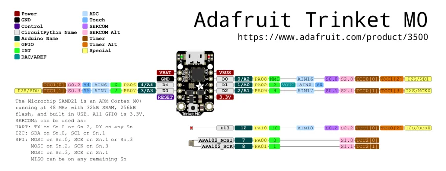

# Trinket M0

**Adafruit** · SAMD21

Revision: Not identified

Coverage: Physical pinout source collected; scope and revision require confirmation

[Browse all manufacturers](../../../../BROWSE.md) · [Devices & IoT](../../../../DEVICES.md) · [Open in the browser guide](https://valleytech-black-wire-guide.pages.dev/?board=adafruit-trinket-m0)

Architecture: **ARM**

## Specifications and hardware documentation

- [Specifications & hardware guide](https://www.adafruit.com/product/3500)

## Original manufacturer graphical reference (PDF)

**original reference PDF** · Reviewed source · PDF

[Open original reference](../../../../library/media/1f565e65abb732c0db3c002b2170b4b657110b48de0acb17b80c4d668d4b27ad.pdf)

**Credit and rights:** Adafruit / original diagram contributors. Rights not established for this asset; attribution retained. Original artwork is not covered by Black Wire's editorial license.. Source/manufacturer: Adafruit.

[Source 1](https://raw.githubusercontent.com/adafruit/Adafruit-Trinket-M0-PCB/4103b9cd2722fadc28dc3969bbe067c6873e0540/Adafruit%20Trinket%20M0%20pinout.pdf) · [Source 2](https://www.adafruit.com/product/3500) · [Source 3](https://github.com/adafruit/Adafruit-Trinket-M0-PCB/tree/4103b9cd2722fadc28dc3969bbe067c6873e0540)

Original publisher reference. Exact board/revision and electrical limits still require confirmation.

Image revision: Not identified

SHA-256: `1f565e65abb732c0db3c002b2170b4b657110b48de0acb17b80c4d668d4b27ad`

## Manufacturer board pinout — page 1

**pinout image** · Reviewed source · PNG

[Open original reference](../../../../library/media/0e8add2b6193525d7c6c1bf4f7a9c56bd44808a3028f09958f5b9b672d5dc33e.png)

**Credit and rights:** Adafruit / original diagram contributors. Rights not established for this asset; attribution retained. Original artwork is not covered by Black Wire's editorial license.. Source/manufacturer: Adafruit.

[Source 1](https://raw.githubusercontent.com/adafruit/Adafruit-Trinket-M0-PCB/4103b9cd2722fadc28dc3969bbe067c6873e0540/Adafruit%20Trinket%20M0%20pinout.pdf) · [Source 2](https://www.adafruit.com/product/3500) · [Source 3](https://github.com/adafruit/Adafruit-Trinket-M0-PCB/tree/4103b9cd2722fadc28dc3969bbe067c6873e0540)

Original publisher reference. Exact board/revision and electrical limits still require confirmation.  PDF page rendered at 144 dpi without changing labels. Original vector PDF retained.

Image revision: Not identified

SHA-256: `0e8add2b6193525d7c6c1bf4f7a9c56bd44808a3028f09958f5b9b672d5dc33e`

Pin assignments have not been independently electrically verified. Check board revision before wiring.
