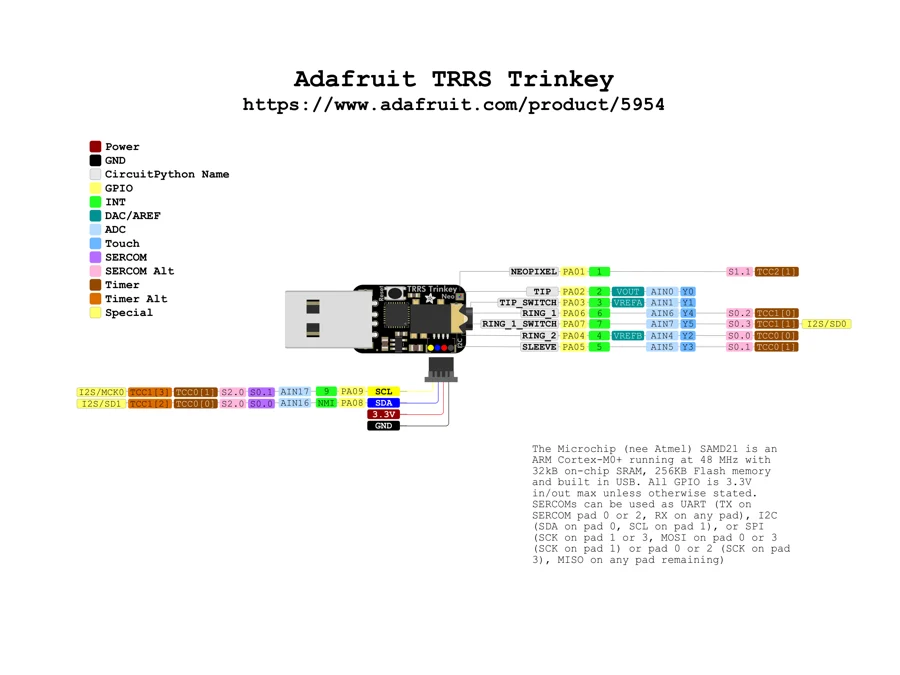

# TRRS Trinkey

**Adafruit** · SAMD21

Revision: Not identified

Coverage: Physical pinout source collected; scope and revision require confirmation

[Browse all manufacturers](../../../../BROWSE.md) · [Devices & IoT](../../../../DEVICES.md) · [Open in the browser guide](https://valleytech-black-wire-guide.pages.dev/?board=adafruit-trrs-trinkey)

Architecture: **ARM**

## Specifications and hardware documentation

- [Specifications & hardware guide](https://www.adafruit.com/product/5954)

## Original manufacturer graphical reference (PDF)

**original reference PDF** · Reviewed source · PDF

[Open original reference](../../../../library/media/ca5af409cb673bc3784d1eea408b87a287e41f39da8ff3bcdd8e568d843a2f64.pdf)

**Credit and rights:** Adafruit / original diagram contributors. Rights not established for this asset; attribution retained. Original artwork is not covered by Black Wire's editorial license.. Source/manufacturer: Adafruit.

[Source 1](https://raw.githubusercontent.com/adafruit/Adafruit-TRRS-Trinkey-PCB/d244f5b5658d5cd1b1bf62de57265185179cdf0f/Adafruit%20TRRS%20Trinkey%20PrettyPins.pdf) · [Source 2](https://www.adafruit.com/product/5954) · [Source 3](https://github.com/adafruit/Adafruit-TRRS-Trinkey-PCB/tree/d244f5b5658d5cd1b1bf62de57265185179cdf0f)

Original publisher reference. Exact board/revision and electrical limits still require confirmation.

Image revision: Not identified

SHA-256: `ca5af409cb673bc3784d1eea408b87a287e41f39da8ff3bcdd8e568d843a2f64`

## Manufacturer board pinout — page 1

**pinout image** · Reviewed source · PNG

[Open original reference](../../../../library/media/ef87fc52fe04904fe85dfb9b937f5d05e7b5546db716b9746da17a70b3a2a176.png)

**Credit and rights:** Adafruit / original diagram contributors. Rights not established for this asset; attribution retained. Original artwork is not covered by Black Wire's editorial license.. Source/manufacturer: Adafruit.

[Source 1](https://raw.githubusercontent.com/adafruit/Adafruit-TRRS-Trinkey-PCB/d244f5b5658d5cd1b1bf62de57265185179cdf0f/Adafruit%20TRRS%20Trinkey%20PrettyPins.pdf) · [Source 2](https://www.adafruit.com/product/5954) · [Source 3](https://github.com/adafruit/Adafruit-TRRS-Trinkey-PCB/tree/d244f5b5658d5cd1b1bf62de57265185179cdf0f)

Original publisher reference. Exact board/revision and electrical limits still require confirmation.  PDF page rendered at 144 dpi without changing labels. Original vector PDF retained.

Image revision: Not identified

SHA-256: `ef87fc52fe04904fe85dfb9b937f5d05e7b5546db716b9746da17a70b3a2a176`

Pin assignments have not been independently electrically verified. Check board revision before wiring.
