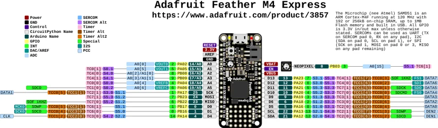

# Feather M4 Express

**Adafruit** · SAMD51

Revision: Not identified

Coverage: Physical pinout source collected; scope and revision require confirmation

[Browse all manufacturers](../../../../BROWSE.md) · [Devices & IoT](../../../../DEVICES.md) · [Open in the browser guide](https://valleytech-black-wire-guide.pages.dev/?board=adafruit-feather-m4-express)

Architecture: **ARM**

## Specifications and hardware documentation

- [Specifications & hardware guide](https://www.adafruit.com/product/3857)

## Original manufacturer graphical reference (PDF)

**original reference PDF** · Reviewed source · PDF

[Open original reference](../../../../library/media/74ea5c818ff0acf32f6631446a8ac253a2de4ec8c477d86defbe557849efb213.pdf)

**Credit and rights:** Adafruit / original diagram contributors. Rights not established for this asset; attribution retained. Original artwork is not covered by Black Wire's editorial license.. Source/manufacturer: Adafruit.

[Source 1](https://raw.githubusercontent.com/adafruit/Adafruit-Feather-M4-Express-PCB/d98407a6071813bc35c39c6e88ca09c0c9ef6f18/Adafruit%20Feather%20M4%20Express%20Pinout.pdf) · [Source 2](https://www.adafruit.com/product/3857) · [Source 3](https://github.com/adafruit/Adafruit-Feather-M4-Express-PCB/tree/d98407a6071813bc35c39c6e88ca09c0c9ef6f18)

Original publisher reference. Exact board/revision and electrical limits still require confirmation.

Image revision: Not identified

SHA-256: `74ea5c818ff0acf32f6631446a8ac253a2de4ec8c477d86defbe557849efb213`

## Manufacturer board pinout — page 1

**pinout image** · Reviewed source · PNG

[Open original reference](../../../../library/media/905fa46673cb6825fad74441391b4af8603b0ad1dd7b6e0602a060c84756cb67.png)

**Credit and rights:** Adafruit / original diagram contributors. Rights not established for this asset; attribution retained. Original artwork is not covered by Black Wire's editorial license.. Source/manufacturer: Adafruit.

[Source 1](https://raw.githubusercontent.com/adafruit/Adafruit-Feather-M4-Express-PCB/d98407a6071813bc35c39c6e88ca09c0c9ef6f18/Adafruit%20Feather%20M4%20Express%20Pinout.pdf) · [Source 2](https://www.adafruit.com/product/3857) · [Source 3](https://github.com/adafruit/Adafruit-Feather-M4-Express-PCB/tree/d98407a6071813bc35c39c6e88ca09c0c9ef6f18)

Original publisher reference. Exact board/revision and electrical limits still require confirmation.  PDF page rendered at 144 dpi without changing labels. Original vector PDF retained.

Image revision: Not identified

SHA-256: `905fa46673cb6825fad74441391b4af8603b0ad1dd7b6e0602a060c84756cb67`

Pin assignments have not been independently electrically verified. Check board revision before wiring.
