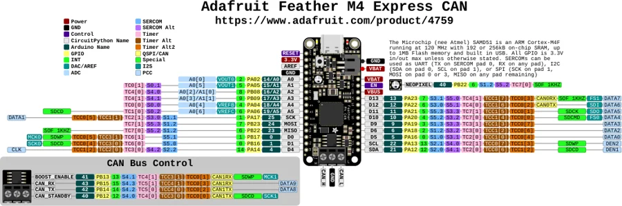

# Feather M4 Express CAN

**Adafruit** · ATSAME51

Revision: Not identified

Coverage: Physical pinout source collected; scope and revision require confirmation

[Browse all manufacturers](../../../../BROWSE.md) · [Devices & IoT](../../../../DEVICES.md) · [Open in the browser guide](https://valleytech-black-wire-guide.pages.dev/?board=adafruit-feather-m4-express-can)

Architecture: **ARM**

## Specifications and hardware documentation

- [Specifications & hardware guide](https://www.adafruit.com/product/4759)

## Original manufacturer graphical reference (PDF)

**original reference PDF** · Reviewed source · PDF

[Open original reference](../../../../library/media/7ad577dc573197303fbf4758b277891851be643fc3d97b3b57c0a44bb56f9950.pdf)

**Credit and rights:** Adafruit / original diagram contributors. Rights not established for this asset; attribution retained. Original artwork is not covered by Black Wire's editorial license.. Source/manufacturer: Adafruit.

[Source 1](https://raw.githubusercontent.com/adafruit/Adafruit-Feather-M4-CAN-PCB/d82af0d26250cb47e0685715276474798bb79470/Adafruit%20Feather%20M4%20Express%20CAN%20Pinout.pdf) · [Source 2](https://www.adafruit.com/product/4759) · [Source 3](https://github.com/adafruit/Adafruit-Feather-M4-CAN-PCB/tree/d82af0d26250cb47e0685715276474798bb79470)

Original publisher reference. Exact board/revision and electrical limits still require confirmation.

Image revision: Not identified

SHA-256: `7ad577dc573197303fbf4758b277891851be643fc3d97b3b57c0a44bb56f9950`

## Manufacturer board pinout — page 1

**pinout image** · Reviewed source · PNG

[Open original reference](../../../../library/media/823ba97fa3717053fa649b9a232dbf3cb56549d436ef36430e525556b6f1c46a.png)

**Credit and rights:** Adafruit / original diagram contributors. Rights not established for this asset; attribution retained. Original artwork is not covered by Black Wire's editorial license.. Source/manufacturer: Adafruit.

[Source 1](https://raw.githubusercontent.com/adafruit/Adafruit-Feather-M4-CAN-PCB/d82af0d26250cb47e0685715276474798bb79470/Adafruit%20Feather%20M4%20Express%20CAN%20Pinout.pdf) · [Source 2](https://www.adafruit.com/product/4759) · [Source 3](https://github.com/adafruit/Adafruit-Feather-M4-CAN-PCB/tree/d82af0d26250cb47e0685715276474798bb79470)

Original publisher reference. Exact board/revision and electrical limits still require confirmation.  PDF page rendered at 144 dpi without changing labels. Original vector PDF retained.

Image revision: Not identified

SHA-256: `823ba97fa3717053fa649b9a232dbf3cb56549d436ef36430e525556b6f1c46a`

Pin assignments have not been independently electrically verified. Check board revision before wiring.
