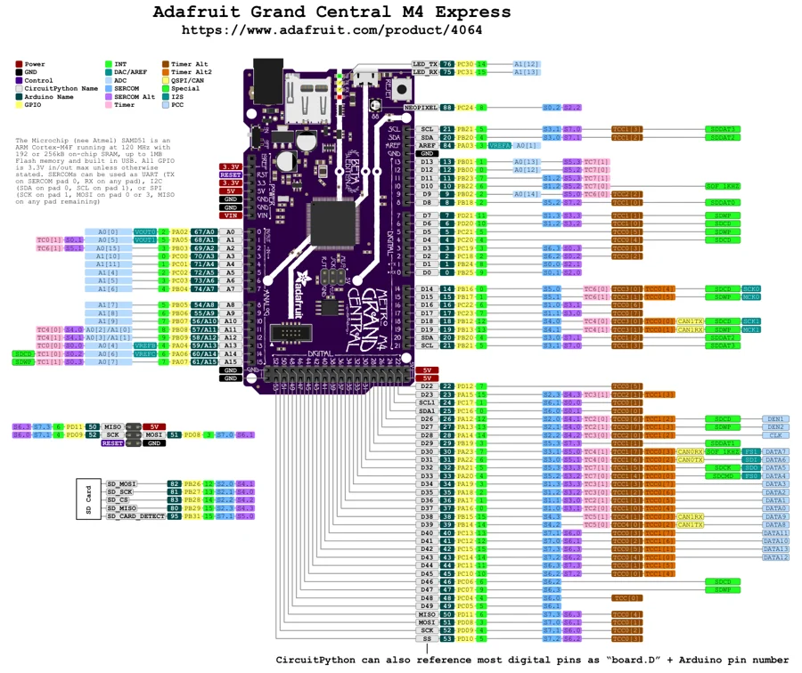

# Grand Central M4 Express

**Adafruit** · SAMD51

Revision: Not identified

Coverage: Physical pinout source collected; scope and revision require confirmation

[Browse all manufacturers](../../../../BROWSE.md) · [Devices & IoT](../../../../DEVICES.md) · [Open in the browser guide](https://valleytech-black-wire-guide.pages.dev/?board=adafruit-grand-central-m4-express)

Architecture: **ARM**

## Specifications and hardware documentation

- [Specifications & hardware guide](https://www.adafruit.com/product/4064)

## Original manufacturer graphical reference (PDF)

**original reference PDF** · Reviewed source · PDF

[Open original reference](../../../../library/media/9e21ae361806a117409552bb79482b0e4acd516535e89263695f477f2dde3eef.pdf)

**Credit and rights:** Adafruit / original diagram contributors. Rights not established for this asset; attribution retained. Original artwork is not covered by Black Wire's editorial license.. Source/manufacturer: Adafruit.

[Source 1](https://raw.githubusercontent.com/adafruit/Adafruit-Grand-Central-PCB/9e59fe3cd1ea37aa6caaf5780fa80956e6ccd74b/Adafruit%20Grand%20Central%20M4%20Express%20Pinout.pdf) · [Source 2](https://www.adafruit.com/product/4064) · [Source 3](https://github.com/adafruit/Adafruit-Grand-Central-PCB/tree/9e59fe3cd1ea37aa6caaf5780fa80956e6ccd74b)

Original publisher reference. Exact board/revision and electrical limits still require confirmation.

Image revision: Not identified

SHA-256: `9e21ae361806a117409552bb79482b0e4acd516535e89263695f477f2dde3eef`

## Manufacturer board pinout — page 1

**pinout image** · Reviewed source · PNG

[Open original reference](../../../../library/media/cc3485193f85c43287861b07b4aca2fc92aac8ec9debe3f41461a73998318d13.png)

**Credit and rights:** Adafruit / original diagram contributors. Rights not established for this asset; attribution retained. Original artwork is not covered by Black Wire's editorial license.. Source/manufacturer: Adafruit.

[Source 1](https://raw.githubusercontent.com/adafruit/Adafruit-Grand-Central-PCB/9e59fe3cd1ea37aa6caaf5780fa80956e6ccd74b/Adafruit%20Grand%20Central%20M4%20Express%20Pinout.pdf) · [Source 2](https://www.adafruit.com/product/4064) · [Source 3](https://github.com/adafruit/Adafruit-Grand-Central-PCB/tree/9e59fe3cd1ea37aa6caaf5780fa80956e6ccd74b)

Original publisher reference. Exact board/revision and electrical limits still require confirmation.  PDF page rendered at 144 dpi without changing labels. Original vector PDF retained.

Image revision: Not identified

SHA-256: `cc3485193f85c43287861b07b4aca2fc92aac8ec9debe3f41461a73998318d13`

Pin assignments have not been independently electrically verified. Check board revision before wiring.
