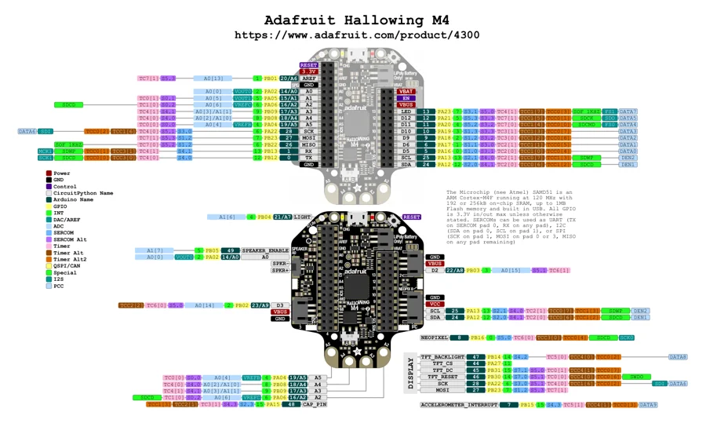

# HalloWing M4

**Adafruit** · SAMD51

Revision: Not identified

Coverage: Physical pinout source collected; scope and revision require confirmation

[Browse all manufacturers](../../../../BROWSE.md) · [Devices & IoT](../../../../DEVICES.md) · [Open in the browser guide](https://valleytech-black-wire-guide.pages.dev/?board=adafruit-hallowing-m4)

Architecture: **ARM**

## Specifications and hardware documentation

- [Specifications & hardware guide](https://www.adafruit.com/product/4300)

## Original manufacturer graphical reference (PDF)

**original reference PDF** · Reviewed source · PDF

[Open original reference](../../../../library/media/99bcdc6ba46312c81e79062359a22d5f48235fa4897bf656af415e32728f8154.pdf)

**Credit and rights:** Adafruit / original diagram contributors. Rights not established for this asset; attribution retained. Original artwork is not covered by Black Wire's editorial license.. Source/manufacturer: Adafruit.

[Source 1](https://raw.githubusercontent.com/adafruit/Adafruit-Hallowing-M4-PCB/24076afe1a14927e0a7cc2fb2cabb8cb0a7cdd27/Adafruit%20HalloWing%20M4%20Pinout.pdf) · [Source 2](https://www.adafruit.com/product/4300) · [Source 3](https://github.com/adafruit/Adafruit-Hallowing-M4-PCB/tree/24076afe1a14927e0a7cc2fb2cabb8cb0a7cdd27)

Original publisher reference. Exact board/revision and electrical limits still require confirmation.

Image revision: Not identified

SHA-256: `99bcdc6ba46312c81e79062359a22d5f48235fa4897bf656af415e32728f8154`

## Manufacturer board pinout — page 1

**pinout image** · Reviewed source · PNG

[Open original reference](../../../../library/media/554c4ce2f1aaac762eb0c8ca426a2f77077f49a5fc4ab80032a671deab1e3b29.png)

**Credit and rights:** Adafruit / original diagram contributors. Rights not established for this asset; attribution retained. Original artwork is not covered by Black Wire's editorial license.. Source/manufacturer: Adafruit.

[Source 1](https://raw.githubusercontent.com/adafruit/Adafruit-Hallowing-M4-PCB/24076afe1a14927e0a7cc2fb2cabb8cb0a7cdd27/Adafruit%20HalloWing%20M4%20Pinout.pdf) · [Source 2](https://www.adafruit.com/product/4300) · [Source 3](https://github.com/adafruit/Adafruit-Hallowing-M4-PCB/tree/24076afe1a14927e0a7cc2fb2cabb8cb0a7cdd27)

Original publisher reference. Exact board/revision and electrical limits still require confirmation.  PDF page rendered at 144 dpi without changing labels. Original vector PDF retained.

Image revision: Not identified

SHA-256: `554c4ce2f1aaac762eb0c8ca426a2f77077f49a5fc4ab80032a671deab1e3b29`

Pin assignments have not been independently electrically verified. Check board revision before wiring.
